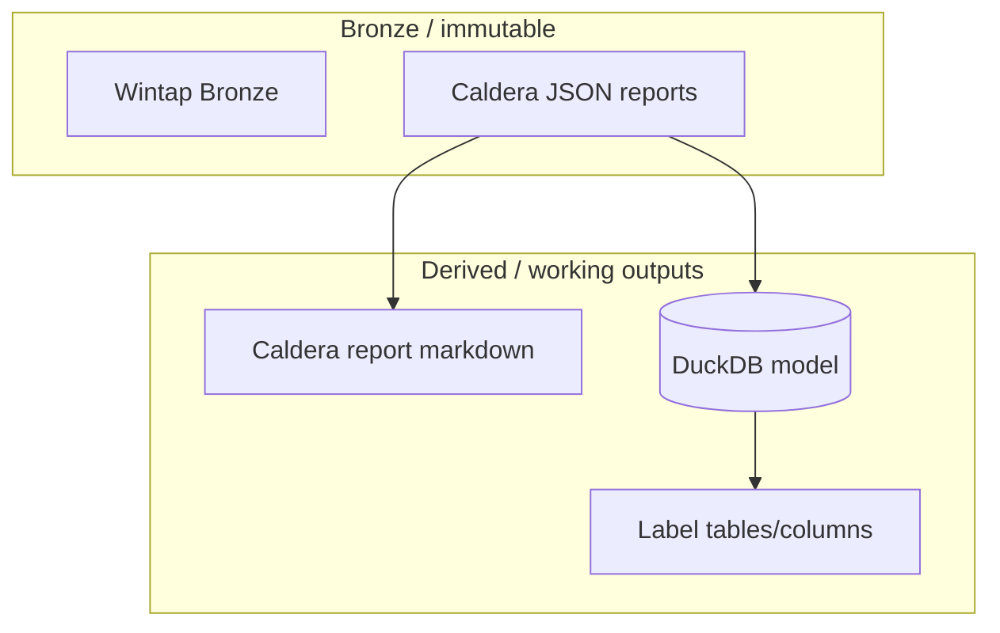

# ACME4 Labeling Notes

Scratchpad and handoff notes for ACME4 labeling/annotation work.

This doc is intentionally lightweight: it points to the concrete artifacts in this repo, and captures open questions.

## Label Sources

| Source | Repo | Description | Where |
| -- | -- | -- |
| Caldera Report (JSON) | GDO | Operation report exported from Caldera | local: `data/wintapv6/ACME4/caldera/*.json` |
| Caldera Report (MD) | Wintap-Analytics | Generated from Caldera JSON (derived; do not hand-edit) | `annotations/acme4/caldera/reports/` |

## Repo/Notebook Entry Points

In this repo:

* `annotations/acme4/sql/labels.ipynb`: labels overview / quick-start.
* `annotations/acme4/sql/lolc.ipynb` and `annotations/acme4/sql/lolc.md`: LOLC flow notes.
* `annotations/acme4/caldera/README.md`: Caldera ingest/explore/report tooling.

External / canonical references:

* GDO: immutable datasets (see links embedded in `annotations/acme4/sql/labels.ipynb`).

## Mental Model

Icons: cloud, database, disk, internet, server

## Open Questions

* What is the stable join key between Caldera activity and process rows (PID_HASH vs host/pid/time heuristic)?
* Which label fields are treated as "ground truth" vs derived heuristics?
* What is the intended final label schema (column names, allowed values, provenance)?

