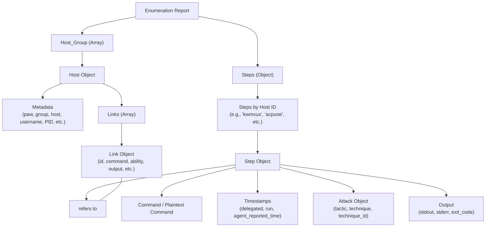

```mermaid
flowchart TD
  A["Enumeration Report"]
  A --> B["Host_Group (Array)"]
  A --> C["Steps (Object)"]

  B --> D["Host Object"]
  D --> D1["Metadata\n(paw, group, host, username, PID, etc.)"]
  D --> D2["Links (Array)"]
  D2 --> D3["Link Object\n(id, command, ability, output, etc.)"]

  C --> E["Steps by Host ID\n(e.g., 'kwmxux', 'acpuoe', etc.)"]
  E --> F["Step Object"]
  F --> F1["Command / Plaintext Command"]
  F --> F2["Timestamps\n(delegated, run, agent_reported_time)"]
  F --> F3["Attack Object\n(tactic, technique, technique_id)"]
  F --> F4["Output\n(stdout, stderr, exit_code)"]
  F --> F5["Link Reference\n(id corresponds to a Link Object)"]

  %% Relationship between steps and host group links via link_id
  D3 --- F5["refers to"]
```
