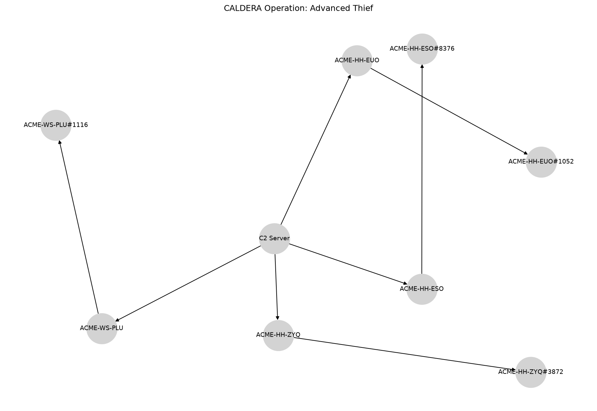

Advanced Thief
==============

# CALDERA Operation Report

**Operation:** Advanced Thief **Start:** 2024-09-13T18:13:19Z **Adversary:** Advanced Thief
# Hosts Attacked

|Host|User|Beachhead Cmd|PID|Parent PID|IPs|C2 Server|
| :---: | :---: | :---: | :---: | :---: | :---: | :---: |
|ACME-HH-ZYQ|ACME\grantj|splunkd.exe|3872|4840|172.31.45.222|http://172.31.10.226:8888|
|ACME-HH-EUO|ACME\grantj|splunkd.exe|1052|2004|172.31.41.178|http://172.31.10.226:8888|
|ACME-WS-PLU|ACME\grantj|splunkd.exe|1116|8312|172.31.11.139, 172.25.240.1|http://172.31.10.226:8888|
|ACME-HH-ESO|ACME\grantj|splunkd.exe|8376|8992|172.31.39.111|http://172.31.10.226:8888|

# Execution Timeline

**[LINK] ACME-HH-ZYQ (kwmxux)**

**Command:** `Clear-History;Clear`

**Description:** N/A

**Technique:** Indicator Removal on Host: Clear Command History

**ATT&CK:** [T1070.003](https://attack.mitre.org/techniques/T1070/003)

**Status:** `Success`

**PID:** 2304

**Time:** 2024-09-04T03:18:40Z → 2024-09-04T03:18:40Z

**[LINK] ACME-HH-EUO (acpuoe)**

**Command:** `Clear-History;Clear`

**Description:** N/A

**Technique:** Indicator Removal on Host: Clear Command History

**ATT&CK:** [T1070.003](https://attack.mitre.org/techniques/T1070/003)

**Status:** `Success`

**PID:** 4324

**Time:** 2024-09-13T17:10:22Z → 2024-09-13T17:10:22Z

**[LINK] ACME-WS-PLU (hkrmxr)**

**Command:** `Clear-History;Clear`

**Description:** N/A

**Technique:** Indicator Removal on Host: Clear Command History

**ATT&CK:** [T1070.003](https://attack.mitre.org/techniques/T1070/003)

**Status:** `Success`

**PID:** 8504

**Time:** 2024-09-13T17:12:11Z → 2024-09-13T17:12:12Z

**[LINK] ACME-HH-ESO (nowkww)**

**Command:** `Clear-History;Clear`

**Description:** N/A

**Technique:** Indicator Removal on Host: Clear Command History

**ATT&CK:** [T1070.003](https://attack.mitre.org/techniques/T1070/003)

**Status:** `Success`

**PID:** 10164

**Time:** 2024-09-13T17:15:40Z → 2024-09-13T17:15:40Z

