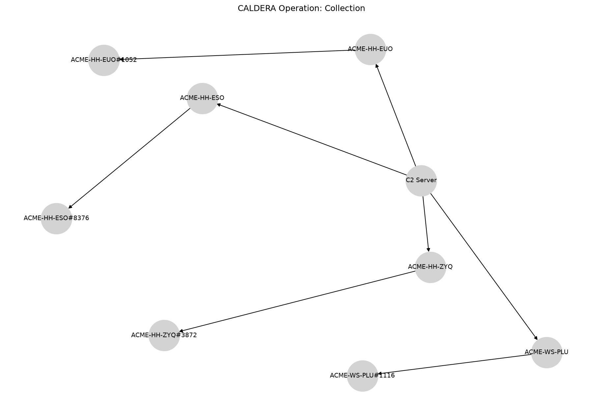

Collection
==========

# CALDERA Operation Report

**Operation:** Collection **Start:** 2024-09-13T18:02:29Z **Adversary:** Collection
# Hosts Attacked

|Host|User|Beachhead Cmd|PID|Parent PID|IPs|C2 Server|
| :---: | :---: | :---: | :---: | :---: | :---: | :---: |
|ACME-HH-ZYQ|ACME\grantj|splunkd.exe|3872|4840|172.31.45.222|http://172.31.10.226:8888|
|ACME-HH-EUO|ACME\grantj|splunkd.exe|1052|2004|172.31.41.178|http://172.31.10.226:8888|
|ACME-WS-PLU|ACME\grantj|splunkd.exe|1116|8312|172.31.11.139, 172.25.240.1|http://172.31.10.226:8888|
|ACME-HH-ESO|ACME\grantj|splunkd.exe|8376|8992|172.31.39.111|http://172.31.10.226:8888|

# Execution Timeline

**[LINK] ACME-HH-ZYQ (kwmxux)**

**Command:** `Clear-History;Clear`

**Description:** N/A

**Technique:** Indicator Removal on Host: Clear Command History

**ATT&CK:** [T1070.003](https://attack.mitre.org/techniques/T1070/003)

**Status:** `Success`

**PID:** 2304

**Time:** 2024-09-04T03:18:40Z → 2024-09-04T03:18:40Z

**[LINK] ACME-HH-EUO (acpuoe)**

**Command:** `Clear-History;Clear`

**Description:** N/A

**Technique:** Indicator Removal on Host: Clear Command History

**ATT&CK:** [T1070.003](https://attack.mitre.org/techniques/T1070/003)

**Status:** `Success`

**PID:** 4324

**Time:** 2024-09-13T17:10:22Z → 2024-09-13T17:10:22Z

**[LINK] ACME-WS-PLU (hkrmxr)**

**Command:** `Clear-History;Clear`

**Description:** N/A

**Technique:** Indicator Removal on Host: Clear Command History

**ATT&CK:** [T1070.003](https://attack.mitre.org/techniques/T1070/003)

**Status:** `Success`

**PID:** 8504

**Time:** 2024-09-13T17:12:11Z → 2024-09-13T17:12:12Z

**[LINK] ACME-HH-ESO (nowkww)**

**Command:** `Clear-History;Clear`

**Description:** N/A

**Technique:** Indicator Removal on Host: Clear Command History

**ATT&CK:** [T1070.003](https://attack.mitre.org/techniques/T1070/003)

**Status:** `Success`

**PID:** 10164

**Time:** 2024-09-13T17:15:40Z → 2024-09-13T17:15:40Z

**[STEP] ACME-HH-ZYQ (kwmxux)**

**Command:** `Get-ChildItem C:\Users -Recurse -Include *.png -ErrorAction 'SilentlyContinue' | foreach {$_.FullName} | Select-Object -first 5;exit 0;`

**Description:** Locate files deemed sensitive

**Technique:** Data from Local System

**ATT&CK:** [T1005](https://attack.mitre.org/techniques/T1005)

**Status:** `Success`

**PID:** 560

**Time:** 2024-09-13T18:02:31Z → N/A

**[STEP] ACME-HH-ZYQ (kwmxux)**

**Command:** `Get-ChildItem C:\Users -Recurse -Include *.yml -ErrorAction 'SilentlyContinue' | foreach {$_.FullName} | Select-Object -first 5;exit 0;`

**Description:** Locate files deemed sensitive

**Technique:** Data from Local System

**ATT&CK:** [T1005](https://attack.mitre.org/techniques/T1005)

**Status:** `Success`

**PID:** 4204

**Time:** 2024-09-13T18:03:31Z → N/A

**[STEP] ACME-HH-ZYQ (kwmxux)**

**Command:** `Get-ChildItem C:\Users -Recurse -Include *.wav -ErrorAction 'SilentlyContinue' | foreach {$_.FullName} | Select-Object -first 5;exit 0;`

**Description:** Locate files deemed sensitive

**Technique:** Data from Local System

**ATT&CK:** [T1005](https://attack.mitre.org/techniques/T1005)

**Status:** `Success`

**PID:** 8356

**Time:** 2024-09-13T18:04:12Z → N/A

**[STEP] ACME-HH-ZYQ (kwmxux)**

**Command:** `New-Item -Path "." -Name "staged" -ItemType "directory" -Force | foreach {$_.FullName} | Select-Object`

**Description:** create a directory for exfil staging

**Technique:** Data Staged: Local Data Staging

**ATT&CK:** [T1074.001](https://attack.mitre.org/techniques/T1074/001)

**Status:** `Failed`

**PID:** 5480

**Time:** 2024-09-13T18:04:52Z → N/A

**[STEP] ACME-HH-EUO (acpuoe)**

**Command:** `Get-ChildItem C:\Users -Recurse -Include *.png -ErrorAction 'SilentlyContinue' | foreach {$_.FullName} | Select-Object -first 5;exit 0;`

**Description:** Locate files deemed sensitive

**Technique:** Data from Local System

**ATT&CK:** [T1005](https://attack.mitre.org/techniques/T1005)

**Status:** `Success`

**PID:** 7104

**Time:** 2024-09-13T18:03:06Z → N/A

**[STEP] ACME-HH-EUO (acpuoe)**

**Command:** `Get-ChildItem C:\Users -Recurse -Include *.yml -ErrorAction 'SilentlyContinue' | foreach {$_.FullName} | Select-Object -first 5;exit 0;`

**Description:** Locate files deemed sensitive

**Technique:** Data from Local System

**ATT&CK:** [T1005](https://attack.mitre.org/techniques/T1005)

**Status:** `Success`

**PID:** 2884

**Time:** 2024-09-13T18:04:00Z → N/A

**[STEP] ACME-HH-EUO (acpuoe)**

**Command:** `Get-ChildItem C:\Users -Recurse -Include *.wav -ErrorAction 'SilentlyContinue' | foreach {$_.FullName} | Select-Object -first 5;exit 0;`

**Description:** Locate files deemed sensitive

**Technique:** Data from Local System

**ATT&CK:** [T1005](https://attack.mitre.org/techniques/T1005)

**Status:** `Success`

**PID:** 6904

**Time:** 2024-09-13T18:04:38Z → N/A

**[STEP] ACME-HH-EUO (acpuoe)**

**Command:** `New-Item -Path "." -Name "staged" -ItemType "directory" -Force | foreach {$_.FullName} | Select-Object`

**Description:** create a directory for exfil staging

**Technique:** Data Staged: Local Data Staging

**ATT&CK:** [T1074.001](https://attack.mitre.org/techniques/T1074/001)

**Status:** `Success`

**PID:** 4736

**Time:** 2024-09-13T18:05:32Z → N/A

**[STEP] ACME-WS-PLU (hkrmxr)**

**Command:** `Get-ChildItem C:\Users -Recurse -Include *.png -ErrorAction 'SilentlyContinue' | foreach {$_.FullName} | Select-Object -first 5;exit 0;`

**Description:** Locate files deemed sensitive

**Technique:** Data from Local System

**ATT&CK:** [T1005](https://attack.mitre.org/techniques/T1005)

**Status:** `Success`

**PID:** 9492

**Time:** 2024-09-13T18:02:52Z → N/A

**[STEP] ACME-WS-PLU (hkrmxr)**

**Command:** `Get-ChildItem C:\Users -Recurse -Include *.yml -ErrorAction 'SilentlyContinue' | foreach {$_.FullName} | Select-Object -first 5;exit 0;`

**Description:** Locate files deemed sensitive

**Technique:** Data from Local System

**ATT&CK:** [T1005](https://attack.mitre.org/techniques/T1005)

**Status:** `Success`

**PID:** 6992

**Time:** 2024-09-13T18:04:02Z → N/A

**[STEP] ACME-WS-PLU (hkrmxr)**

**Command:** `Get-ChildItem C:\Users -Recurse -Include *.wav -ErrorAction 'SilentlyContinue' | foreach {$_.FullName} | Select-Object -first 5;exit 0;`

**Description:** Locate files deemed sensitive

**Technique:** Data from Local System

**ATT&CK:** [T1005](https://attack.mitre.org/techniques/T1005)

**Status:** `Success`

**PID:** 204

**Time:** 2024-09-13T18:04:46Z → N/A

**[STEP] ACME-WS-PLU (hkrmxr)**

**Command:** `New-Item -Path "." -Name "staged" -ItemType "directory" -Force | foreach {$_.FullName} | Select-Object`

**Description:** create a directory for exfil staging

**Technique:** Data Staged: Local Data Staging

**ATT&CK:** [T1074.001](https://attack.mitre.org/techniques/T1074/001)

**Status:** `Success`

**PID:** 8836

**Time:** 2024-09-13T18:05:45Z → N/A

**[STEP] ACME-HH-ESO (nowkww)**

**Command:** `Get-ChildItem C:\Users -Recurse -Include *.png -ErrorAction 'SilentlyContinue' | foreach {$_.FullName} | Select-Object -first 5;exit 0;`

**Description:** Locate files deemed sensitive

**Technique:** Data from Local System

**ATT&CK:** [T1005](https://attack.mitre.org/techniques/T1005)

**Status:** `Success`

**PID:** 1880

**Time:** 2024-09-13T18:02:55Z → N/A

**[STEP] ACME-HH-ESO (nowkww)**

**Command:** `Get-ChildItem C:\Users -Recurse -Include *.yml -ErrorAction 'SilentlyContinue' | foreach {$_.FullName} | Select-Object -first 5;exit 0;`

**Description:** Locate files deemed sensitive

**Technique:** Data from Local System

**ATT&CK:** [T1005](https://attack.mitre.org/techniques/T1005)

**Status:** `Success`

**PID:** 8840

**Time:** 2024-09-13T18:03:37Z → N/A

**[STEP] ACME-HH-ESO (nowkww)**

**Command:** `Get-ChildItem C:\Users -Recurse -Include *.wav -ErrorAction 'SilentlyContinue' | foreach {$_.FullName} | Select-Object -first 5;exit 0;`

**Description:** Locate files deemed sensitive

**Technique:** Data from Local System

**ATT&CK:** [T1005](https://attack.mitre.org/techniques/T1005)

**Status:** `Success`

**PID:** 1312

**Time:** 2024-09-13T18:04:33Z → N/A

**[STEP] ACME-HH-ESO (nowkww)**

**Command:** `New-Item -Path "." -Name "staged" -ItemType "directory" -Force | foreach {$_.FullName} | Select-Object`

**Description:** create a directory for exfil staging

**Technique:** Data Staged: Local Data Staging

**ATT&CK:** [T1074.001](https://attack.mitre.org/techniques/T1074/001)

**Status:** `Success`

**PID:** 8544

**Time:** 2024-09-13T18:05:24Z → N/A

