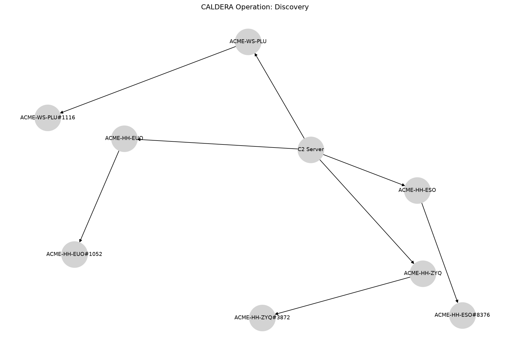

Discovery
=========

# CALDERA Operation Report

**Operation:** Discovery **Start:** 2024-09-13T17:16:24Z **Adversary:** Discovery
# Hosts Attacked

|Host|User|Beachhead Cmd|PID|Parent PID|IPs|C2 Server|
| :---: | :---: | :---: | :---: | :---: | :---: | :---: |
|ACME-HH-ZYQ|ACME\grantj|splunkd.exe|3872|4840|172.31.45.222|http://172.31.10.226:8888|
|ACME-HH-EUO|ACME\grantj|splunkd.exe|1052|2004|172.31.41.178|http://172.31.10.226:8888|
|ACME-WS-PLU|ACME\grantj|splunkd.exe|1116|8312|172.31.11.139, 172.25.240.1|http://172.31.10.226:8888|
|ACME-HH-ESO|ACME\grantj|splunkd.exe|8376|8992|172.31.39.111|http://172.31.10.226:8888|

# Execution Timeline

**[LINK] ACME-HH-ZYQ (kwmxux)**

**Command:** `Clear-History;Clear`

**Description:** N/A

**Technique:** Indicator Removal on Host: Clear Command History

**ATT&CK:** [T1070.003](https://attack.mitre.org/techniques/T1070/003)

**Status:** `Success`

**PID:** 2304

**Time:** 2024-09-04T03:18:40Z → 2024-09-04T03:18:40Z

**[LINK] ACME-HH-EUO (acpuoe)**

**Command:** `Clear-History;Clear`

**Description:** N/A

**Technique:** Indicator Removal on Host: Clear Command History

**ATT&CK:** [T1070.003](https://attack.mitre.org/techniques/T1070/003)

**Status:** `Success`

**PID:** 4324

**Time:** 2024-09-13T17:10:22Z → 2024-09-13T17:10:22Z

**[LINK] ACME-WS-PLU (hkrmxr)**

**Command:** `Clear-History;Clear`

**Description:** N/A

**Technique:** Indicator Removal on Host: Clear Command History

**ATT&CK:** [T1070.003](https://attack.mitre.org/techniques/T1070/003)

**Status:** `Success`

**PID:** 8504

**Time:** 2024-09-13T17:12:11Z → 2024-09-13T17:12:12Z

**[LINK] ACME-HH-ESO (nowkww)**

**Command:** `Clear-History;Clear`

**Description:** N/A

**Technique:** Indicator Removal on Host: Clear Command History

**ATT&CK:** [T1070.003](https://attack.mitre.org/techniques/T1070/003)

**Status:** `Success`

**PID:** 10164

**Time:** 2024-09-13T17:15:40Z → 2024-09-13T17:15:40Z

**[STEP] ACME-HH-ZYQ (kwmxux)**

**Command:** `$env:username`

**Description:** Find user running agent

**Technique:** System Owner/User Discovery

**ATT&CK:** [T1033](https://attack.mitre.org/techniques/T1033)

**Status:** `Success`

**PID:** 5892

**Time:** 2024-09-13T17:16:48Z → N/A

**[STEP] ACME-HH-ZYQ (kwmxux)**

**Command:** `Get-WmiObject -Class Win32_UserAccount`

**Description:** Identify all local users

**Technique:** Account Discovery: Local Account

**ATT&CK:** [T1087.001](https://attack.mitre.org/techniques/T1087/001)

**Status:** `Success`

**PID:** 3848

**Time:** 2024-09-13T17:17:57Z → N/A

**[STEP] ACME-HH-ZYQ (kwmxux)**

**Command:** `$owners = @{};gwmi win32_process |% {$owners[$_.handle] = $_.getowner().user};$ps = get-process | select processname,Id,@{l="Owner";e={$owners[$_.id.tostring()]}};foreach($p in $ps) {    if($p.Owner -eq "grantj") {        $p;    }}`

**Description:** Get process info for processes running as a user

**Technique:** Process Discovery

**ATT&CK:** [T1057](https://attack.mitre.org/techniques/T1057)

**Status:** `Success`

**PID:** 8112

**Time:** 2024-09-13T17:19:02Z → N/A

**[STEP] ACME-HH-ZYQ (kwmxux)**

**Command:** `Get-SmbShare | ConvertTo-Json`

**Description:** Network Share Discovery

**Technique:** Network Share Discovery

**ATT&CK:** [T1135](https://attack.mitre.org/techniques/T1135)

**Status:** `Success`

**PID:** 3212

**Time:** 2024-09-13T17:19:58Z → N/A

**[STEP] ACME-HH-ZYQ (kwmxux)**

**Command:** `nltest /dsgetdc:$env:USERDOMAIN`

**Description:** Identify the remote domain controllers

**Technique:** Remote System Discovery

**ATT&CK:** [T1018](https://attack.mitre.org/techniques/T1018)

**Status:** `Success`

**PID:** 5804

**Time:** 2024-09-13T17:20:35Z → N/A

**[STEP] ACME-HH-ZYQ (kwmxux)**

**Command:** `wmic /NAMESPACE:\\root\SecurityCenter2 PATH AntiVirusProduct GET /value`

**Description:** Identify AV

**Technique:** Software Discovery: Security Software Discovery

**ATT&CK:** [T1518.001](https://attack.mitre.org/techniques/T1518/001)

**Status:** `Failed`

**PID:** 2204

**Time:** 2024-09-13T17:21:38Z → N/A

**[STEP] ACME-HH-ZYQ (kwmxux)**

**Command:** `gpresult /R`

**Description:** Summary of permission and security groups

**Technique:** Permission Groups Discovery: Local Groups

**ATT&CK:** [T1069.001](https://attack.mitre.org/techniques/T1069/001)

**Status:** `Success`

**PID:** 3224

**Time:** 2024-09-13T17:22:21Z → N/A

**[STEP] ACME-HH-ZYQ (kwmxux)**

**Command:** `$NameSpace = Get-WmiObject -Namespace "root" -Class "__Namespace" | Select Name | Out-String -Stream | Select-String "SecurityCenter";$SecurityCenter = $NameSpace | Select-Object -First 1;Get-WmiObject -Namespace "root\$SecurityCenter" -Class AntiVirusProduct | Select DisplayName, InstanceGuid, PathToSignedProductExe, PathToSignedReportingExe, ProductState, Timestamp | Format-List;`

**Description:** Identify Firewalls

**Technique:** Software Discovery: Security Software Discovery

**ATT&CK:** [T1518.001](https://attack.mitre.org/techniques/T1518/001)

**Status:** `Failed`

**PID:** 8696

**Time:** 2024-09-13T17:23:10Z → N/A

**[STEP] ACME-HH-EUO (acpuoe)**

**Command:** `$env:username`

**Description:** Find user running agent

**Technique:** System Owner/User Discovery

**ATT&CK:** [T1033](https://attack.mitre.org/techniques/T1033)

**Status:** `Success`

**PID:** 6696

**Time:** 2024-09-13T17:17:00Z → N/A

**[STEP] ACME-HH-EUO (acpuoe)**

**Command:** `Get-WmiObject -Class Win32_UserAccount`

**Description:** Identify all local users

**Technique:** Account Discovery: Local Account

**ATT&CK:** [T1087.001](https://attack.mitre.org/techniques/T1087/001)

**Status:** `Success`

**PID:** 1284

**Time:** 2024-09-13T17:17:36Z → N/A

**[STEP] ACME-HH-EUO (acpuoe)**

**Command:** `$owners = @{};gwmi win32_process |% {$owners[$_.handle] = $_.getowner().user};$ps = get-process | select processname,Id,@{l="Owner";e={$owners[$_.id.tostring()]}};foreach($p in $ps) {    if($p.Owner -eq "grantj") {        $p;    }}`

**Description:** Get process info for processes running as a user

**Technique:** Process Discovery

**ATT&CK:** [T1057](https://attack.mitre.org/techniques/T1057)

**Status:** `Success`

**PID:** 7080

**Time:** 2024-09-13T17:18:15Z → N/A

**[STEP] ACME-HH-EUO (acpuoe)**

**Command:** `Get-SmbShare | ConvertTo-Json`

**Description:** Network Share Discovery

**Technique:** Network Share Discovery

**ATT&CK:** [T1135](https://attack.mitre.org/techniques/T1135)

**Status:** `Success`

**PID:** 5496

**Time:** 2024-09-13T17:19:07Z → N/A

**[STEP] ACME-HH-EUO (acpuoe)**

**Command:** `nltest /dsgetdc:$env:USERDOMAIN`

**Description:** Identify the remote domain controllers

**Technique:** Remote System Discovery

**ATT&CK:** [T1018](https://attack.mitre.org/techniques/T1018)

**Status:** `Success`

**PID:** 2176

**Time:** 2024-09-13T17:20:27Z → N/A

**[STEP] ACME-HH-EUO (acpuoe)**

**Command:** `wmic /NAMESPACE:\\root\SecurityCenter2 PATH AntiVirusProduct GET /value`

**Description:** Identify AV

**Technique:** Software Discovery: Security Software Discovery

**ATT&CK:** [T1518.001](https://attack.mitre.org/techniques/T1518/001)

**Status:** `Failed`

**PID:** 7020

**Time:** 2024-09-13T17:21:14Z → N/A

**[STEP] ACME-HH-EUO (acpuoe)**

**Command:** `gpresult /R`

**Description:** Summary of permission and security groups

**Technique:** Permission Groups Discovery: Local Groups

**ATT&CK:** [T1069.001](https://attack.mitre.org/techniques/T1069/001)

**Status:** `Success`

**PID:** 5988

**Time:** 2024-09-13T17:22:00Z → N/A

**[STEP] ACME-HH-EUO (acpuoe)**

**Command:** `$NameSpace = Get-WmiObject -Namespace "root" -Class "__Namespace" | Select Name | Out-String -Stream | Select-String "SecurityCenter";$SecurityCenter = $NameSpace | Select-Object -First 1;Get-WmiObject -Namespace "root\$SecurityCenter" -Class AntiVirusProduct | Select DisplayName, InstanceGuid, PathToSignedProductExe, PathToSignedReportingExe, ProductState, Timestamp | Format-List;`

**Description:** Identify Firewalls

**Technique:** Software Discovery: Security Software Discovery

**ATT&CK:** [T1518.001](https://attack.mitre.org/techniques/T1518/001)

**Status:** `Failed`

**PID:** 6576

**Time:** 2024-09-13T17:22:57Z → N/A

**[STEP] ACME-WS-PLU (hkrmxr)**

**Command:** `$env:username`

**Description:** Find user running agent

**Technique:** System Owner/User Discovery

**ATT&CK:** [T1033](https://attack.mitre.org/techniques/T1033)

**Status:** `Success`

**PID:** 1564

**Time:** 2024-09-13T17:16:46Z → N/A

**[STEP] ACME-WS-PLU (hkrmxr)**

**Command:** `Get-WmiObject -Class Win32_UserAccount`

**Description:** Identify all local users

**Technique:** Account Discovery: Local Account

**ATT&CK:** [T1087.001](https://attack.mitre.org/techniques/T1087/001)

**Status:** `Success`

**PID:** 816

**Time:** 2024-09-13T17:17:41Z → N/A

**[STEP] ACME-WS-PLU (hkrmxr)**

**Command:** `$owners = @{};gwmi win32_process |% {$owners[$_.handle] = $_.getowner().user};$ps = get-process | select processname,Id,@{l="Owner";e={$owners[$_.id.tostring()]}};foreach($p in $ps) {    if($p.Owner -eq "grantj") {        $p;    }}`

**Description:** Get process info for processes running as a user

**Technique:** Process Discovery

**ATT&CK:** [T1057](https://attack.mitre.org/techniques/T1057)

**Status:** `Success`

**PID:** 9420

**Time:** 2024-09-13T17:18:28Z → N/A

**[STEP] ACME-WS-PLU (hkrmxr)**

**Command:** `Get-SmbShare | ConvertTo-Json`

**Description:** Network Share Discovery

**Technique:** Network Share Discovery

**ATT&CK:** [T1135](https://attack.mitre.org/techniques/T1135)

**Status:** `Success`

**PID:** 7012

**Time:** 2024-09-13T17:19:20Z → N/A

**[STEP] ACME-WS-PLU (hkrmxr)**

**Command:** `nltest /dsgetdc:$env:USERDOMAIN`

**Description:** Identify the remote domain controllers

**Technique:** Remote System Discovery

**ATT&CK:** [T1018](https://attack.mitre.org/techniques/T1018)

**Status:** `Success`

**PID:** 1916

**Time:** 2024-09-13T17:20:18Z → N/A

**[STEP] ACME-WS-PLU (hkrmxr)**

**Command:** `wmic /NAMESPACE:\\root\SecurityCenter2 PATH AntiVirusProduct GET /value`

**Description:** Identify AV

**Technique:** Software Discovery: Security Software Discovery

**ATT&CK:** [T1518.001](https://attack.mitre.org/techniques/T1518/001)

**Status:** `Failed`

**PID:** 5116

**Time:** 2024-09-13T17:21:17Z → N/A

**[STEP] ACME-WS-PLU (hkrmxr)**

**Command:** `gpresult /R`

**Description:** Summary of permission and security groups

**Technique:** Permission Groups Discovery: Local Groups

**ATT&CK:** [T1069.001](https://attack.mitre.org/techniques/T1069/001)

**Status:** `Success`

**PID:** 2924

**Time:** 2024-09-13T17:21:59Z → N/A

**[STEP] ACME-WS-PLU (hkrmxr)**

**Command:** `$NameSpace = Get-WmiObject -Namespace "root" -Class "__Namespace" | Select Name | Out-String -Stream | Select-String "SecurityCenter";$SecurityCenter = $NameSpace | Select-Object -First 1;Get-WmiObject -Namespace "root\$SecurityCenter" -Class AntiVirusProduct | Select DisplayName, InstanceGuid, PathToSignedProductExe, PathToSignedReportingExe, ProductState, Timestamp | Format-List;`

**Description:** Identify Firewalls

**Technique:** Software Discovery: Security Software Discovery

**ATT&CK:** [T1518.001](https://attack.mitre.org/techniques/T1518/001)

**Status:** `Failed`

**PID:** 1432

**Time:** 2024-09-13T17:23:00Z → N/A

**[STEP] ACME-HH-ESO (nowkww)**

**Command:** `$env:username`

**Description:** Find user running agent

**Technique:** System Owner/User Discovery

**ATT&CK:** [T1033](https://attack.mitre.org/techniques/T1033)

**Status:** `Success`

**PID:** 9552

**Time:** 2024-09-13T17:17:03Z → N/A

**[STEP] ACME-HH-ESO (nowkww)**

**Command:** `Get-WmiObject -Class Win32_UserAccount`

**Description:** Identify all local users

**Technique:** Account Discovery: Local Account

**ATT&CK:** [T1087.001](https://attack.mitre.org/techniques/T1087/001)

**Status:** `Success`

**PID:** 5588

**Time:** 2024-09-13T17:18:00Z → N/A

**[STEP] ACME-HH-ESO (nowkww)**

**Command:** `$owners = @{};gwmi win32_process |% {$owners[$_.handle] = $_.getowner().user};$ps = get-process | select processname,Id,@{l="Owner";e={$owners[$_.id.tostring()]}};foreach($p in $ps) {    if($p.Owner -eq "grantj") {        $p;    }}`

**Description:** Get process info for processes running as a user

**Technique:** Process Discovery

**ATT&CK:** [T1057](https://attack.mitre.org/techniques/T1057)

**Status:** `Success`

**PID:** 5836

**Time:** 2024-09-13T17:18:51Z → N/A

**[STEP] ACME-HH-ESO (nowkww)**

**Command:** `Get-SmbShare | ConvertTo-Json`

**Description:** Network Share Discovery

**Technique:** Network Share Discovery

**ATT&CK:** [T1135](https://attack.mitre.org/techniques/T1135)

**Status:** `Success`

**PID:** 8224

**Time:** 2024-09-13T17:19:21Z → N/A

**[STEP] ACME-HH-ESO (nowkww)**

**Command:** `nltest /dsgetdc:$env:USERDOMAIN`

**Description:** Identify the remote domain controllers

**Technique:** Remote System Discovery

**ATT&CK:** [T1018](https://attack.mitre.org/techniques/T1018)

**Status:** `Success`

**PID:** 8244

**Time:** 2024-09-13T17:20:16Z → N/A

**[STEP] ACME-HH-ESO (nowkww)**

**Command:** `wmic /NAMESPACE:\\root\SecurityCenter2 PATH AntiVirusProduct GET /value`

**Description:** Identify AV

**Technique:** Software Discovery: Security Software Discovery

**ATT&CK:** [T1518.001](https://attack.mitre.org/techniques/T1518/001)

**Status:** `Failed`

**PID:** 9404

**Time:** 2024-09-13T17:21:13Z → N/A

**[STEP] ACME-HH-ESO (nowkww)**

**Command:** `gpresult /R`

**Description:** Summary of permission and security groups

**Technique:** Permission Groups Discovery: Local Groups

**ATT&CK:** [T1069.001](https://attack.mitre.org/techniques/T1069/001)

**Status:** `Success`

**PID:** 584

**Time:** 2024-09-13T17:22:06Z → N/A

**[STEP] ACME-HH-ESO (nowkww)**

**Command:** `$NameSpace = Get-WmiObject -Namespace "root" -Class "__Namespace" | Select Name | Out-String -Stream | Select-String "SecurityCenter";$SecurityCenter = $NameSpace | Select-Object -First 1;Get-WmiObject -Namespace "root\$SecurityCenter" -Class AntiVirusProduct | Select DisplayName, InstanceGuid, PathToSignedProductExe, PathToSignedReportingExe, ProductState, Timestamp | Format-List;`

**Description:** Identify Firewalls

**Technique:** Software Discovery: Security Software Discovery

**ATT&CK:** [T1518.001](https://attack.mitre.org/techniques/T1518/001)

**Status:** `Failed`

**PID:** 8204

**Time:** 2024-09-13T17:22:52Z → N/A

