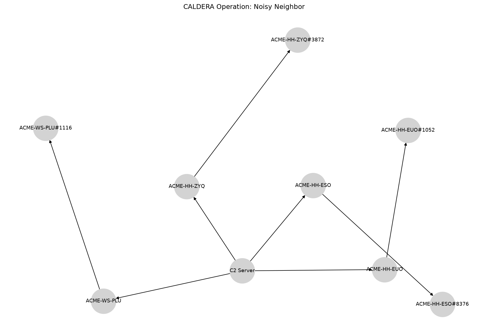

Noisy Neighbor
==============

# CALDERA Operation Report

**Operation:** Noisy Neighbor **Start:** 2024-09-13T17:47:13Z **Adversary:** Nosy Neighbor
# Hosts Attacked

|Host|User|Beachhead Cmd|PID|Parent PID|IPs|C2 Server|
| :---: | :---: | :---: | :---: | :---: | :---: | :---: |
|ACME-HH-ZYQ|ACME\grantj|splunkd.exe|3872|4840|172.31.45.222|http://172.31.10.226:8888|
|ACME-HH-EUO|ACME\grantj|splunkd.exe|1052|2004|172.31.41.178|http://172.31.10.226:8888|
|ACME-WS-PLU|ACME\grantj|splunkd.exe|1116|8312|172.31.11.139, 172.25.240.1|http://172.31.10.226:8888|
|ACME-HH-ESO|ACME\grantj|splunkd.exe|8376|8992|172.31.39.111|http://172.31.10.226:8888|

# Execution Timeline

**[LINK] ACME-HH-ZYQ (kwmxux)**

**Command:** `Clear-History;Clear`

**Description:** N/A

**Technique:** Indicator Removal on Host: Clear Command History

**ATT&CK:** [T1070.003](https://attack.mitre.org/techniques/T1070/003)

**Status:** `Success`

**PID:** 2304

**Time:** 2024-09-04T03:18:40Z → 2024-09-04T03:18:40Z

**[LINK] ACME-HH-EUO (acpuoe)**

**Command:** `Clear-History;Clear`

**Description:** N/A

**Technique:** Indicator Removal on Host: Clear Command History

**ATT&CK:** [T1070.003](https://attack.mitre.org/techniques/T1070/003)

**Status:** `Success`

**PID:** 4324

**Time:** 2024-09-13T17:10:22Z → 2024-09-13T17:10:22Z

**[LINK] ACME-WS-PLU (hkrmxr)**

**Command:** `Clear-History;Clear`

**Description:** N/A

**Technique:** Indicator Removal on Host: Clear Command History

**ATT&CK:** [T1070.003](https://attack.mitre.org/techniques/T1070/003)

**Status:** `Success`

**PID:** 8504

**Time:** 2024-09-13T17:12:11Z → 2024-09-13T17:12:12Z

**[LINK] ACME-HH-ESO (nowkww)**

**Command:** `Clear-History;Clear`

**Description:** N/A

**Technique:** Indicator Removal on Host: Clear Command History

**ATT&CK:** [T1070.003](https://attack.mitre.org/techniques/T1070/003)

**Status:** `Success`

**PID:** 10164

**Time:** 2024-09-13T17:15:40Z → 2024-09-13T17:15:40Z

**[STEP] ACME-HH-ZYQ (kwmxux)**

**Command:** `Clear-History;Clear`

**Description:** Stop terminal from logging history

**Technique:** Indicator Removal on Host: Clear Command History

**ATT&CK:** [T1070.003](https://attack.mitre.org/techniques/T1070/003)

**Status:** `Success`

**PID:** 3772

**Time:** 2024-09-13T17:48:09Z → N/A

**[STEP] ACME-HH-ZYQ (kwmxux)**

**Command:** `$env:username`

**Description:** Find user running agent

**Technique:** System Owner/User Discovery

**ATT&CK:** [T1033](https://attack.mitre.org/techniques/T1033)

**Status:** `Success`

**PID:** 7620

**Time:** 2024-09-13T17:48:44Z → N/A

**[STEP] ACME-HH-ZYQ (kwmxux)**

**Command:** `arp -a`

**Description:** Locate all active IP and FQDNs on the network

**Technique:** Remote System Discovery

**ATT&CK:** [T1018](https://attack.mitre.org/techniques/T1018)

**Status:** `Success`

**PID:** 788

**Time:** 2024-09-13T17:49:38Z → N/A

**[STEP] ACME-HH-ZYQ (kwmxux)**

**Command:** `Get-Process`

**Description:** Identify system processes

**Technique:** Process Discovery

**ATT&CK:** [T1057](https://attack.mitre.org/techniques/T1057)

**Status:** `Success`

**PID:** 5252

**Time:** 2024-09-13T17:50:28Z → N/A

**[STEP] ACME-HH-ZYQ (kwmxux)**

**Command:** `.\obfuscated_payload.ps1 -Scan`

**Description:** View all potential WIFI networks on host

**Technique:** System Network Configuration Discovery

**ATT&CK:** [T1016](https://attack.mitre.org/techniques/T1016)

**Status:** `Failed`

**PID:** 4060

**Time:** 2024-09-13T17:51:05Z → N/A

**[STEP] ACME-HH-ZYQ (kwmxux)**

**Command:** `.\wifi.ps1 -Pref`

**Description:** See the most used WIFI networks of a machine

**Technique:** System Network Configuration Discovery

**ATT&CK:** [T1016](https://attack.mitre.org/techniques/T1016)

**Status:** `Failed`

**PID:** 4032

**Time:** 2024-09-13T17:51:58Z → N/A

**[STEP] ACME-HH-ZYQ (kwmxux)**

**Command:** `.\wifi.ps1 -Off`

**Description:** Turn a computers WIFI off

**Technique:** Endpoint Denial of Service

**ATT&CK:** [T1499](https://attack.mitre.org/techniques/T1499)

**Status:** `Failed`

**PID:** 9172

**Time:** 2024-09-13T17:52:52Z → N/A

**[STEP] ACME-HH-EUO (acpuoe)**

**Command:** `Clear-History;Clear`

**Description:** Stop terminal from logging history

**Technique:** Indicator Removal on Host: Clear Command History

**ATT&CK:** [T1070.003](https://attack.mitre.org/techniques/T1070/003)

**Status:** `Success`

**PID:** 1168

**Time:** 2024-09-13T17:47:14Z → N/A

**[STEP] ACME-HH-EUO (acpuoe)**

**Command:** `$env:username`

**Description:** Find user running agent

**Technique:** System Owner/User Discovery

**ATT&CK:** [T1033](https://attack.mitre.org/techniques/T1033)

**Status:** `Success`

**PID:** 440

**Time:** 2024-09-13T17:48:37Z → N/A

**[STEP] ACME-HH-EUO (acpuoe)**

**Command:** `arp -a`

**Description:** Locate all active IP and FQDNs on the network

**Technique:** Remote System Discovery

**ATT&CK:** [T1018](https://attack.mitre.org/techniques/T1018)

**Status:** `Success`

**PID:** 4032

**Time:** 2024-09-13T17:49:26Z → N/A

**[STEP] ACME-HH-EUO (acpuoe)**

**Command:** `Get-Process`

**Description:** Identify system processes

**Technique:** Process Discovery

**ATT&CK:** [T1057](https://attack.mitre.org/techniques/T1057)

**Status:** `Success`

**PID:** 1876

**Time:** 2024-09-13T17:50:18Z → N/A

**[STEP] ACME-HH-EUO (acpuoe)**

**Command:** `.\obfuscated_payload.ps1 -Scan`

**Description:** View all potential WIFI networks on host

**Technique:** System Network Configuration Discovery

**ATT&CK:** [T1016](https://attack.mitre.org/techniques/T1016)

**Status:** `Failed`

**PID:** 2264

**Time:** 2024-09-13T17:51:06Z → N/A

**[STEP] ACME-HH-EUO (acpuoe)**

**Command:** `.\wifi.ps1 -Pref`

**Description:** See the most used WIFI networks of a machine

**Technique:** System Network Configuration Discovery

**ATT&CK:** [T1016](https://attack.mitre.org/techniques/T1016)

**Status:** `Success`

**PID:** 7008

**Time:** 2024-09-13T17:51:59Z → N/A

**[STEP] ACME-HH-EUO (acpuoe)**

**Command:** `.\wifi.ps1 -Off`

**Description:** Turn a computers WIFI off

**Technique:** Endpoint Denial of Service

**ATT&CK:** [T1499](https://attack.mitre.org/techniques/T1499)

**Status:** `Success`

**PID:** 6856

**Time:** 2024-09-13T17:52:39Z → N/A

**[STEP] ACME-WS-PLU (hkrmxr)**

**Command:** `Clear-History;Clear`

**Description:** Stop terminal from logging history

**Technique:** Indicator Removal on Host: Clear Command History

**ATT&CK:** [T1070.003](https://attack.mitre.org/techniques/T1070/003)

**Status:** `Success`

**PID:** 7788

**Time:** 2024-09-13T17:47:52Z → N/A

**[STEP] ACME-WS-PLU (hkrmxr)**

**Command:** `$env:username`

**Description:** Find user running agent

**Technique:** System Owner/User Discovery

**ATT&CK:** [T1033](https://attack.mitre.org/techniques/T1033)

**Status:** `Success`

**PID:** 8628

**Time:** 2024-09-13T17:48:30Z → N/A

**[STEP] ACME-WS-PLU (hkrmxr)**

**Command:** `arp -a`

**Description:** Locate all active IP and FQDNs on the network

**Technique:** Remote System Discovery

**ATT&CK:** [T1018](https://attack.mitre.org/techniques/T1018)

**Status:** `Success`

**PID:** 8772

**Time:** 2024-09-13T17:49:12Z → N/A

**[STEP] ACME-WS-PLU (hkrmxr)**

**Command:** `Get-Process`

**Description:** Identify system processes

**Technique:** Process Discovery

**ATT&CK:** [T1057](https://attack.mitre.org/techniques/T1057)

**Status:** `Success`

**PID:** 9596

**Time:** 2024-09-13T17:50:02Z → N/A

**[STEP] ACME-WS-PLU (hkrmxr)**

**Command:** `.\obfuscated_payload.ps1 -Scan`

**Description:** View all potential WIFI networks on host

**Technique:** System Network Configuration Discovery

**ATT&CK:** [T1016](https://attack.mitre.org/techniques/T1016)

**Status:** `Failed`

**PID:** 8512

**Time:** 2024-09-13T17:50:56Z → N/A

**[STEP] ACME-WS-PLU (hkrmxr)**

**Command:** `.\wifi.ps1 -Pref`

**Description:** See the most used WIFI networks of a machine

**Technique:** System Network Configuration Discovery

**ATT&CK:** [T1016](https://attack.mitre.org/techniques/T1016)

**Status:** `Success`

**PID:** 9628

**Time:** 2024-09-13T17:51:49Z → N/A

**[STEP] ACME-WS-PLU (hkrmxr)**

**Command:** `.\wifi.ps1 -Off`

**Description:** Turn a computers WIFI off

**Technique:** Endpoint Denial of Service

**ATT&CK:** [T1499](https://attack.mitre.org/techniques/T1499)

**Status:** `Success`

**PID:** 6628

**Time:** 2024-09-13T17:52:51Z → N/A

**[STEP] ACME-HH-ESO (nowkww)**

**Command:** `Clear-History;Clear`

**Description:** Stop terminal from logging history

**Technique:** Indicator Removal on Host: Clear Command History

**ATT&CK:** [T1070.003](https://attack.mitre.org/techniques/T1070/003)

**Status:** `Success`

**PID:** 9856

**Time:** 2024-09-13T17:48:00Z → N/A

**[STEP] ACME-HH-ESO (nowkww)**

**Command:** `$env:username`

**Description:** Find user running agent

**Technique:** System Owner/User Discovery

**ATT&CK:** [T1033](https://attack.mitre.org/techniques/T1033)

**Status:** `Success`

**PID:** 8484

**Time:** 2024-09-13T17:49:03Z → N/A

**[STEP] ACME-HH-ESO (nowkww)**

**Command:** `arp -a`

**Description:** Locate all active IP and FQDNs on the network

**Technique:** Remote System Discovery

**ATT&CK:** [T1018](https://attack.mitre.org/techniques/T1018)

**Status:** `Success`

**PID:** 9856

**Time:** 2024-09-13T17:49:42Z → N/A

**[STEP] ACME-HH-ESO (nowkww)**

**Command:** `Get-Process`

**Description:** Identify system processes

**Technique:** Process Discovery

**ATT&CK:** [T1057](https://attack.mitre.org/techniques/T1057)

**Status:** `Success`

**PID:** 4036

**Time:** 2024-09-13T17:50:22Z → N/A

**[STEP] ACME-HH-ESO (nowkww)**

**Command:** `.\obfuscated_payload.ps1 -Scan`

**Description:** View all potential WIFI networks on host

**Technique:** System Network Configuration Discovery

**ATT&CK:** [T1016](https://attack.mitre.org/techniques/T1016)

**Status:** `Failed`

**PID:** 6856

**Time:** 2024-09-13T17:51:14Z → N/A

**[STEP] ACME-HH-ESO (nowkww)**

**Command:** `.\wifi.ps1 -Pref`

**Description:** See the most used WIFI networks of a machine

**Technique:** System Network Configuration Discovery

**ATT&CK:** [T1016](https://attack.mitre.org/techniques/T1016)

**Status:** `Success`

**PID:** 3856

**Time:** 2024-09-13T17:52:05Z → N/A

**[STEP] ACME-HH-ESO (nowkww)**

**Command:** `.\wifi.ps1 -Off`

**Description:** Turn a computers WIFI off

**Technique:** Endpoint Denial of Service

**ATT&CK:** [T1499](https://attack.mitre.org/techniques/T1499)

**Status:** `Success`

**PID:** 3616

**Time:** 2024-09-13T17:53:05Z → N/A

