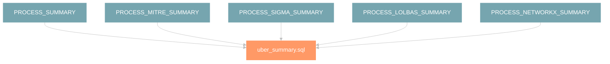
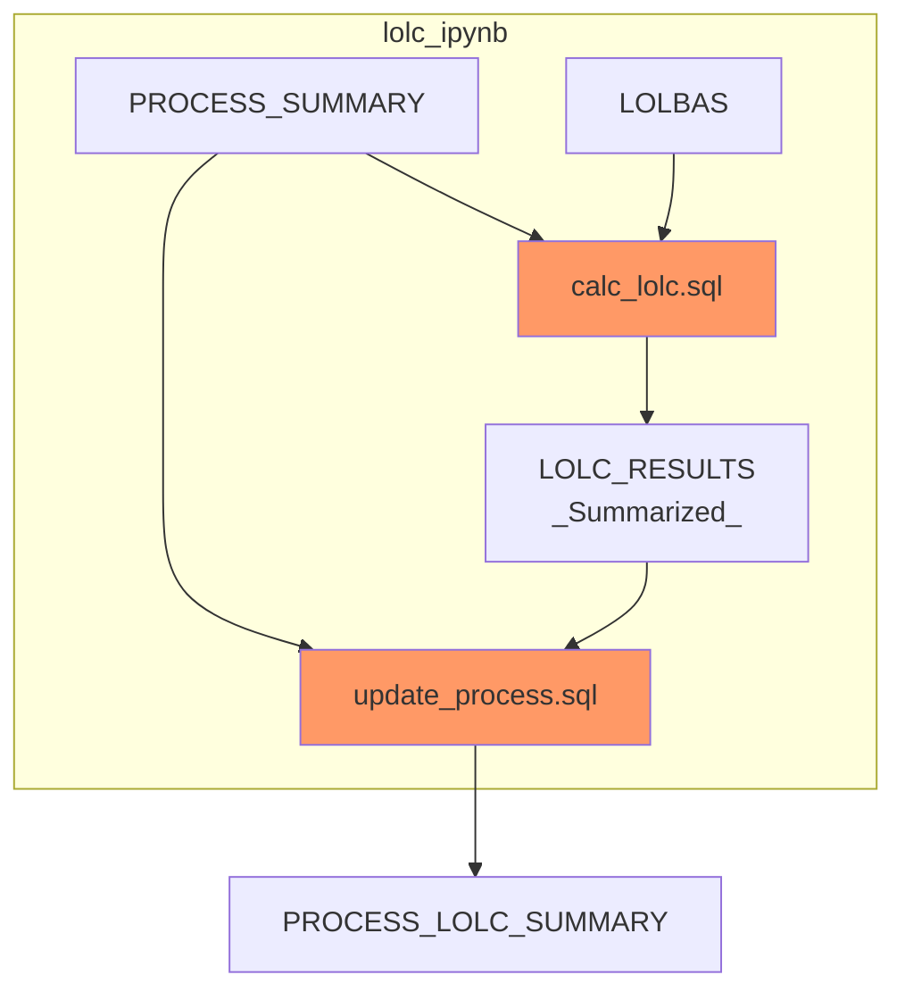

# Attempt to describe LOLC flow
Inspiration: https://github.com/akash-adhikary/analyse-etl-flow

```mermaid
%%{
  init: {
  "theme": "base",
    "themeVariables": {
      "primaryColor": "#76a5af",
      "primaryTextColor": "#fff",
      "primaryBorderColor": "#00000",
      "lineColor": "#AAAA",
      "secondaryColor": "#006100",
      "tertiaryColor": "#fff"
    }
  }
}%%

flowchart
PROCESS_SUMMARY --> uber_summary.sql:::sqlClass;
PROCESS_MITRE_SUMMARY --> uber_summary.sql;
PROCESS_SIGMA_SUMMARY --> uber_summary.sql;
PROCESS_LOLBAS_SUMMARY --> uber_summary.sql;
PROCESS_NETWORKX_SUMMARY --> uber_summary.sql;
classDef sqlClass fill:#f96;
```

```mermaid
flowchart
LOLC_RESULTS["LOLC_RESULTS
_Summarized_
"]
subgraph lolc_ipynb
PROCESS_SUMMARY --> calc_lolc.sql:::sqlClass;
LOLBAS --> calc_lolc.sql;
calc_lolc.sql --> LOLC_RESULTS;
PROCESS_SUMMARY --> update_process.sql:::sqlClass;
LOLC_RESULTS --> update_process.sql;
end
update_process.sql --> PROCESS_LOLC_SUMMARY;
classDef sqlClass fill:#f96;

```

